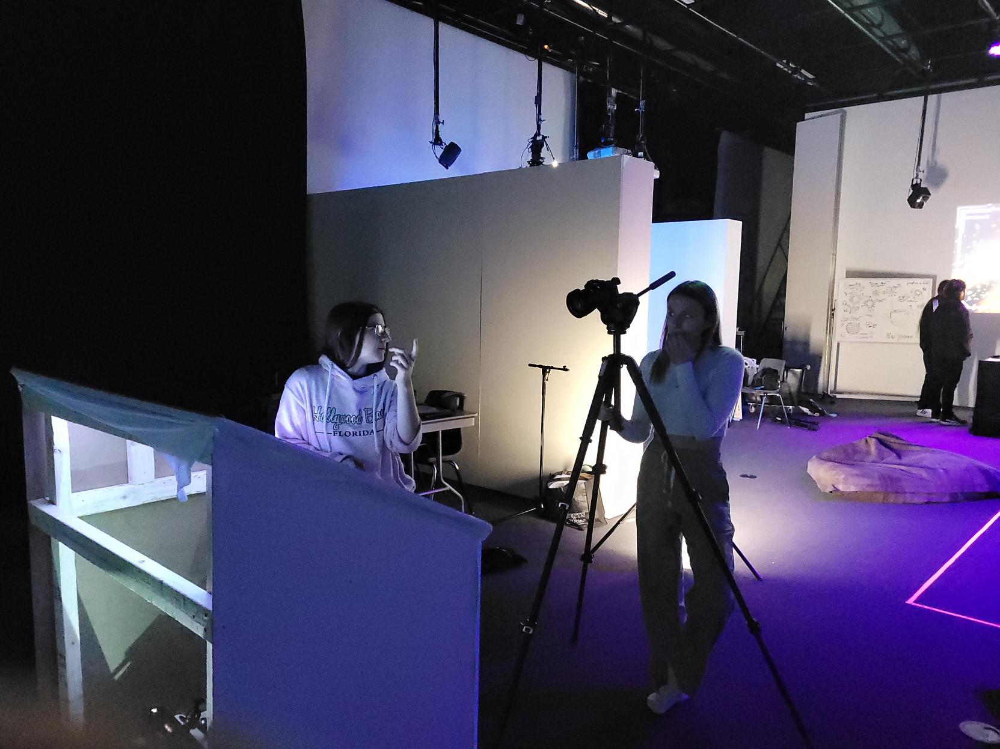

# Journal de création

## Semaine 9
> Contenu personnalisé à remplir par les équipes à chaque semaine faisant part du processus de création: résumé des réalisations d'équipe effectuées et des défis rencontrés sous forme d'un texte; ajout de vidéos, images, documents audios ou de contenu multimédia.)

Cette semaine a été parsemée de défis.

Tout d’abord, comme prévu, nous avons terminé de créer nos images dans Photoshop et le contenu 3D dans Maya. Nous avons également avancé la programmation multimédia du projet dans le logiciel Max et Unity.

Par la suite, nous avions prévu une séance d’enregistrement audio dans les studios de son. Cependant, misère (!), une panne d’électricité a eu lieu durant notre séance! Nous avons donc dû remettre celle-ci à quelques jours plus tard. (Nous avons beaucoup ri de cette situation.)

Enfin, nous venons de commencer à mettre en espace le projet dans le grand studio du collège. Nos projecteurs viennent tout juste d’être installés! 

On a bien hâte de voir le projet se concrétiser davantage dans les lieux physiques. À suivre

## Semaine 8

## Semaine 7
### Lundi 
Scrum et nous avons arrangé les côtés de la structure pour cacher les clous.

### Mardi 
La rencontre avec les profs nous a fait réaliser qu'on devrait ajouter le 3ᵉ projecteur pour enlever l'effet moustiquaire que les pixels des deux autres projecteurs donnent puisqu'ils sont vraiment éloignés. Nous avons aussi ajusté pour que le projo se ferme lorsqu'il n'y a rien de projeté pour ne pas qu'on voie le carré de lumière. Nous avons aussi procédé au filage du projecteur derrière la toile pour que ce soit plus propre.

</img>

### Mercredi
Nous avons décidé de fermer le 3ᵉ projo pour pouvoir se concentrer sur le son, l'effet de pan et le flou de la vidéo lorsqu'on appuie pas fort, c'est flou, et si on appuie à deux mains, c'est net. Nous avons aussi fait le tournage pour la vidéo promotionnelle ce qu'on a faite en avant midi.

</img>
### Jeudi 
Nous allons nous concentrer sur le mapping du troisième projo pour se rendre compte qu'il n'était pas aligné avec les autres donc nous allons essayer de le déplacer pour l'aligner avec les autres. Nous avons aussi mis l'auto-iris pour faire en sorte que lorsque que la vidéo finit, le projecteur s'éteint pour qu'on ne voie pas le rectangle de la projection.

### Vendredi

On s'est rendu compte que l'auto iris arrêtait de fonctionner si personne ne touchait la toile pendant plusieurs minutes. Nous avons aussi tout nettoyer notre place de travail et rangé la table pour faire de la place.

## Semaine de relache
### Mercredi 
On a réimporté les vidéos dans TouchDesigner après les avoirs modifiées. Nous avons aussi eu des problèmes avec le sont son qui apparaissait quand on changeait de vidéos. Après plusieurs tentatives et l'aide des profs à distance, nous avons réussi à régler le problème de pop qui apparaissait dans les haut-parleurs. Nous avons réalisé qu'un de nos haut-parleurs fonctionnait pas à cause d'un fil jack qui était brisé.

### Jeudi 
Nous avons identifié les sorties audio pour rendre le rebranchement dans la salle des matrices plus efficace. Nous avons par la suite procédé au rebranchement et tout fonctionnait du premier coup.

</img>

</img>

## Semaine 6
### lundi 
Srum + planification de la semaine

### Mardi 
On a ajouté 2 autres haut-parleurs au plafond nous avons aussi ajouté les DI nécessaires, ce qui nous a pris plus de temps que prévu. Nous avons aussi essayé d'arranger les côtés de la structure qui décollait.

</img>

### Mercredi 
Nous avons remarqué que les haut-parleurs allaient en mode veille, donc on a dû les démonter et changer une switch pour le désactiver.

### Jeudi 
Nous avons amélioré la détection de la main et le son lié au vidéo correspondant.

</img>
### Vendredi 
Nous avons remarqué que l'audio de certaines vidéos n'était pas aussi fort comparé aux autres, donc on a dû les réexporter pour qu'ils soient les plus égales que possible.

## Semaine 5

### Lundi 
Présentation de la maquette.

### Mardi
Nous avons présenté l'effet sur le son des vidéos aux professeurs. Ensuite, Thomas nous a aidé pour changer l'intensité de l'effet selon le niveau d'interaction. En ce moment, nous essayons de trouver une solution aux problèmes avec l'audio de certains vidéos.

### Mercredi 
Nous avons fait le mapping des vidéos sur les murs de côté et nous avons crées des zones sur la toile correspondant à ceux-ci (mur droit avec le côté droit de la toile, mur de centre avec le centre de la toile, mur gauche avec le côté gauche de la toile). Nous avons aussi branché les haut-parleurs au plafond.

### Jeudi 
Présentation des sons à Thomas. Nous avons aussi passé les fils XLR sous le plancher pour les cacher du public car il n'y avait pas de prise XLR sous la trappe où on a notre toile.

### Vendredi 
Nous avons fait en sorte que, selon la partie de la toile où on met notre main, les vidéos apparaissent sur le mur correspondant. Nous avons aussi ajouté le son de la toile qu'on a modifié et on a fait en sorte qu'un son suit le mouvement de la main lorsqu'elle bouge.

## Semaine 4

### Lundi 
Scrum

### Mardi 
Durant la rencontre avec les profs, nous avons discuté de la disposition des projecteurs et nous avons convenu d'en mettre deux un en dessous de l'autre pour augmenter la luminosité de la projection. Nous avons aussi réalisé qu'une licence TouchDesigner pourrait être pratique pour améliorer la qualité tes projections. Nous avons par la suite procédé à enlever les haut-parleurs et les projecteurs qui étaient déjà installés.

### Mercredi
Nous avons commencé par apporter la structure qui allait tenir la toile pour commencer la maquette fonctionnelle. Une fois la maquette installé, nous avons commencé à mettre le projecteur et la Kinect en-dessous de celle-ci. Une des planches de bois de la boîte est dans le chemin, donc nous avons dû ajuster le projecteur correctement pour qu'elle ne cache pas la projection. Nous avons ensuite installé les projcteurs au plafond.

</img>

### Jeudi 
Après avoir présenté notre avancement à Thomas, nous avons commencer à brancher les câbles et les _transmitters_ pour les projecteurs en prenant note des numéros des prises ethernets pour être capable de les relier à l'ordinateur. Nous avons aussi fait en sorte qu'on peut voir le changement des vidéos à chaque fois qu'on appuie sur la toile. Nous avons aussi invité quelqu'un à tester notre projet et ça nous a permis de comprendre comment on pouvait améliorer la detection de la main.

### Vendredi
Nous nous sommes concentrés sur le mapping des projecteurs et le branchement des haut-parleurs pour les reliers à TouchDesigner. Suite à ça, nous avons fait des tests pour être sûr que le son sort bien quand on appuit sur la toile et le son ambiant est constant.

</img>

## Semaine 3

### Lundi 
Nous avons regardé les vidéos des préproductions de chaque équipe pour après apporter des modifications le lendemain, si nécessaire.

### Mardi 
Nous avons modifié notre vidéo de la préproduction et travaillé le son d'ambiance de notre oeuvre. De plus, nous avons continué les tests avec la toile et les souvenirs, fait en sorte que quand l'interacteur appuie légèrement sur la toile la vidéo est moins claire et que quand la personne appuis plus fort le souvenir devient plus clair.

### Mercredi 
Nous avons transféré les souvenirs de la caméra de Laurie dans un ordinateur grâce à OBS. Nous avons aussi réussi à faire en sorte que, lorsqu'on enlève notre main de la toile, la vidéo change aléatoirement pour qu'un nouveau souvenir apparait au mur.

</img>

### Jeudi 
Nous avons eu une rencontre avec Thomas pour parler des actions que l'interacteur pourrait faire avec notre oeuvre. Laurie a travaillé sur la colorisation des souvenirs. Maika a travaillé sur l'importation des souvenirs dans TouchDesigner. Jolyanne et Felix se sont occupé de mettre à jour le GitHub.

### Vendredi 
Nous avons travailler sur trouver une manière de changer les souvenir lorsqu'on appuit sur la toile.

## Semaine 2
### Lundi 

Nous avons commencé la semaine avec un scrum de groupe et après le scrum nous nous sommes concentré sur les mesure de la toile et revérifier les mesures , nos possibilités pour la toile de Spandex et des idées de comment on pourrait la faire tenir sans être déchirer. 

### Mardi 

Nous avons eu notre reencontre hebdomadaire avec Guillaume et Thomas sur l'avancement du projet. En discutant avec eu nous avons décidé d'au lieu de projeter des souvenirs en forme de lignes , nous devrions upté pour quelque chose de plus concret... Des vrai souvenir vidéo. Après la discussion nous sommes partie acheter la toile pour commencer nos test de détection avec la toile.

</img>

### Mercredi
Nous avons commencer nos tests avec la toile nous avons commencer avec une plus grande surface pour nos tests, nous avons aussi regarder l'angle de la kinect et la distance minimum à laquel la kinect peut capter. Nous avons donc commencer les tests.

### Jeudi
Nous avons ajouté la projection sur la toile avec obs et madmapper. Nous avons aussi commencer l'effet que l'on veut sur les souvenirs avec DAvinci pour apres les intégrer dans touchdesigner pour créer l'effet particule que l'on desire ajouter. Nous avons aussi améliorer la détection avec plusieurs mains, c'est pas parfait encore.

### Vendredi 
Nous avons commencer à essayer de faire en sorte que quand une main est détecter que sa face jouer une vidéo particule. Nous avons aussi commencer à trouver de l'inspiration pour le logo.

## Semaine 1

### Lundi 

Première journée de cours 

### Mardi 
Première rencontre avec les profs, nous avons représenté notre préproduction, soulevé quelques problèmes.Donc suite à la rencontre, nous avons repensé notre projet,  trouvé d'autres inspirations pour la projection sur le mur et sur la toile. Felix et Maïka ont commencé quelques tutoriels Touchdesigner pour se familiariser avec le logiciel. Laurie a trouvé des inspirations pour les sons et a commencé la liste de matériel. Jolyanne continuait à trouver des inspirations générales et à corriger la préproduction avec les ajustements qu'on a faits.

### Mercredi
Avant le cours, on a commencé l'organisation des prochaines semaines. Maïka et Laurie ont commencé à regarder des tutoriels pour les effets qui pourraient être intéressants dans Touchdesigner et les ont testés.

</img>

Pour la première semaine, nous avons dû repenser à notre projet et aller plus en détail dans le choix de notre thème et l'esthétique dans lequel nous voulons aller. Nous avons aussi commencé les tests avec la Kinect pour détecter le mouvement.
 
Durant le cours, on a montré à Guillaume les modifications qu'on a apportées à notre projet et essayé de trouver les mesures de la toile et des idées à comment la faire tenir.

Après le cours, nous sommes restés et avons commencé à faire des tests avec la Kinect pour voir si on était capable de capter les mouvements de la main et de faire apparaître des effets à l'écran.
Résultats : 

### Jeudi 

Cours avec Thomas qui servait à déterminer le thème et le nom de notre exposition.

Résultat:

### Vendredi 

Vendredi étant une période autonome, nous avons décidé d'intégrer la toile à nos tests. Après quelques tutoriels, Felix et Maïka ont réussi à détecter la distance entre la caméra de la Kinect et la toile lorsqu'on appuie sur celle-ci. Laurie a commencé à faire des sons, qu'elle nous a montrés, et Jolyanne a fait moodboard général du projet et vérifié la liste de matériel. 

</img>

</img>

