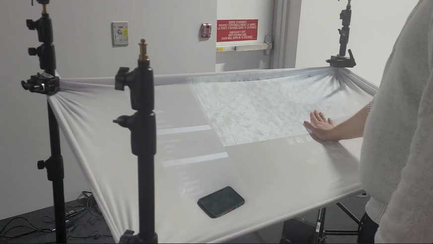

# Journal de création

## Semaine 9
> Contenu personnalisé à remplir par les équipes à chaque semaine faisant part du processus de création: résumé des réalisations d'équipe effectuées et des défis rencontrés sous forme d'un texte; ajout de vidéos, images, documents audios ou de contenu multimédia.)

Cette semaine a été parsemée de défis.

Tout d’abord, comme prévu, nous avons terminé de créer nos images dans Photoshop et le contenu 3D dans Maya. Nous avons également avancé la programmation multimédia du projet dans le logiciel Max et Unity.

Par la suite, nous avions prévu une séance d’enregistrement audio dans les studios de son. Cependant, misère (!), une panne d’électricité a eu lieu durant notre séance! Nous avons donc dû remettre celle-ci à quelques jours plus tard. (Nous avons beaucoup ri de cette situation.)

Enfin, nous venons de commencer à mettre en espace le projet dans le grand studio du collège. Nos projecteurs viennent tout juste d’être installés! 

On a bien hâte de voir le projet se concrétiser davantage dans les lieux physiques. À suivre

## Semaine 8

## Semaine 7

## Semaine 6

## Semaine 5

## Semaine 4

## Semaine 3

## Semaine 2
### Lundi 

Nous avons commencé la semaine avec un scrum de groupe et après le scrum nous nous sommes concentré sur les mesure de la toile et revérifier les mesures , nos possibilités pour la toile de Spandex et des idées de comment on pourrait la faire tenir sans être déchirer. 

### Mardi 

Nous avons eu notre reencontre hebdomadaire avec Guillaume et Thomas sur l'avancement du projet. En discutant avec eu nous avons décidé d'au lieu de projeter des souvenirs en forme de lignes , nous devrions upté pour quelque chose de plus concret... Des vrai souvenir vidéo. Après la discussion nous sommes partie acheter la toile pour commencer nos test de détection avec la toile.

### Mercredi
Nous avons commencer nos tests avec la toile nous avons commencer avec une plus grande surface pour nos tests, nous avons aussi regarder l'angle de la kinect et la distance minimum à laquel la kinect peut capter. Nous avons donc commencer les tests.

### Jeudi
Nous avons ajouté la projection sur la toile avec obs et madmapper. Nous avons aussi commencer l'effet que l'on veut sur les souvenirs avec DAvinci pour apres les intégrer dans touchdesigner pour créer l'effet particule que l'on desire ajouter. Nous avons aussi améliorer la détection avec plusieurs mains, c'est pas parfait encore.

### Vendredi 
Nous avons commencer à essayer de faire en sorte que quand une main est détecter que sa face jouer une vidéo particule. Nous avons aussi commencer à trouver de l'inspiration pour le logo.

## Semaine 1

### Lundi 

Première journée de cours 

### Mardi 
Première rencontre avec les profs, nous avons représenté notre préproduction, soulevé quelques problèmes.Donc suite à la rencontre, nous avons repensé notre projet,  trouvé d'autres inspirations pour la projection sur le mur et sur la toile. Felix et Maïka ont commencé quelques tutoriels Touchdesigner pour se familiariser avec le logiciel. Laurie a trouvé des inspirations pour les sons et a commencé la liste de matériel. Jolyanne continuait à trouver des inspirations générales et à corriger la préproduction avec les ajustements qu'on a fait.

### Mercredi
Avant le cours, on a commencé l'organisation des prochaines semaines. Maïka et Laurie ont commencé à regarder des tutoriels pour les effets qui pourraient être intéressants dans Touchdesigner et les ont testés.

Pour la première semaine, nous avons dû repenser à notre projet et aller plus en détail dans le choix de notre thème et l'esthétique dans lequel nous voulons aller. Nous avons aussi commencé les tests avec la Kinect pour détecter le mouvement.
 
Durant le cours, on a montré à Guillaume, les modifications qu'on a apportées à notre projet et essayé de trouver les mesures de la toile et des idées à comment la faire tenir.

Après le cours, nous sommes restés et avons commencé à faire des tests avec la Kinect pour voir si on était capable de capter les mouvements de la main et de faire apparaître des effets à l'écran.
Résultats : 

### Jeudi 

Cours avec Thomas qui servait à déterminer le thème et le nom de notre exposition.

Résultat:

### vendredi 

Vendredi étant une période autonome, nous avons décidé d'intégrer la toile à nos tests. Après quelques tutoriels, Felix et Maïka ont réussi à détecter la distance entre la caméra de la Kinect et la toile lorsqu'on appuie sur celle-ci. Laurie a commencé à faire des sons, qu'elle nous a montré, et Jolyanne a fait moodboard général du projet et vérifié la liste de matériels.

