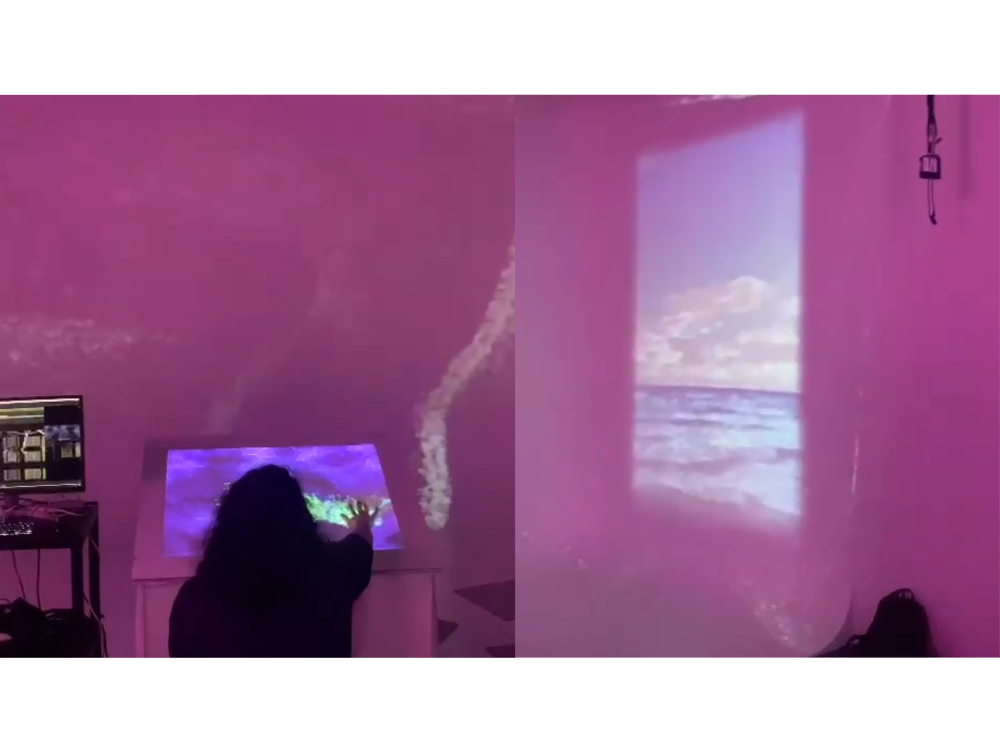

# Journal de Felix Testa Radovanovic

* [Semaine 1](#semaine-1)
* [Semaine 2](#semaine-2)
* [Semaine 3](#semaine-3)
* [Semaine 4](#semaine-4)
* [Semaine 5](#semaine-5)
* [Semaine 6](#semaine-6)
* [Semaine de rattrapage](#semaine-de-rattrapage)
* [Semaine 7](#semaine-7)
* [Semaine 8](#semaine-8)
* [Semaine 9](#semaine-9)

## Semaine 1

### Résumé des réalisations effectuées
- Essais dans TouchDesigner pour ce qui se retrouvera sur la toile
- Tracking de la main à l'aide d'une Kinect afin de bouger une forme dans TouchDesigner
- Au moins deux personnes peuvent intéragir avec TouchDesigner à l'aide de la Kinect
- Détection de la distance entre la Kinect et la toile à l'appui
- Blob tracking de l'endroit où l'interacteur appuie
  
### Image d'une réalisation dont tu es la ou le plus fier

### Est-ce que j'ai accompli l'ensemble des tâches et objectifs que je m'étais fixés pour cette semaine?	
- [x] Complètement
- [ ] Assez
- [ ] Peu
- [ ] Pas du tout

#### Décrivez pourquoi.
Comme ce n'est que la première semaine, nous n'avons pas besoin d'être tant avancé dans le projet. J'ai réussi à faire les tâches dont je me suis attribué, notamment en lien avec TouchDesigner, donc je dirais que cette semaine est fut un succès pour ma part! De plus, j'ai fini une partie du travail dont je pensais allais me prendre beaucoup plus longtemps, donc je suis très fier de moi!

### Mon projet s'est-il réalisé selon l’échéancier prévu?

- [x] Complètement
- [ ] Assez
- [ ] Un peu
- [ ] Pas tout à fait

### Défis pour la prochaine semaine
Nous avons un vidéo à faire pour la deuxième semaine, donc mes coéquipières et moi devrions s'assurer qu'on arrive à atteindre nos buts selon notre horaire en ayant une vidéo de bonne qualité. 

---
## Semaine 2
### Résumé des réalisations effectuées
- Retravaillé le tracking avec la toile
- Retravaillé la détection de la main sur la toile
- Préparé la démo pour les portes ouvertes
- Enregistré la vidéo de présentation

### Image d'une réalisation dont tu es la ou le plus fier

### Est-ce que j'ai accompli l'ensemble des tâches et objectifs que je m'étais fixés pour cette semaine?

- [ ] Complètement
- [x] Assez
- [ ] Peu
- [ ] Pas du tout

#### Décrivez pourquoi.
 J'ai réussi à faire en gros ce dont je devais faire, comme la détection d'une main sur la toile et le tracking de celle-ci. Cependant, il n'est pas encore super précis, et aussi lorsqu'on s'approche du bord de la toile, la détection devient moins précise. De plus, la plupart des interacteurs qui ne font pas parti de mon équipe intéragissent initiallement avec leur doigt, alors que la détection n'est pas encore calibré pour détecter quelque chose d'aussi petit. 

#### S'il y a lieu, qu'allez-vous faire pour remédier à la situation?
 Je vais devoir trouver une manière pour améliorer la détection. En ce moment, je pense que ça se fera que par essai-erreur, mais il se peut qu'en ligne il y a des tutoriels sur comment jouer avec les paramètres dans TouchDesigner.

### Mon projet s'est-il réalisé selon l’échéancier prévu?

- [ ] Complètement
- [x] Assez
- [ ] Un peu
- [ ] Pas tout à fait

#### S'il y a des écarts, décrivez-les.
En ce qui me concerne, j'ai réalisé ce que j'avais à faire dans le temps donné, mais il y a toujours des problèmes pour le mapping vidéo sur la toile et il faudrait qu'on commence la construction de ce qui va tenir la toile et contenir la Kinect et le projecteur pour pouvoir faire des vrai tests pour calibrer la détection de la distance de la toile.

#### S'il y a lieu, qu'allez-vous faire pour remédier à la situation?
Ce qui nous faut vraiment est la boîte qui contiendra tous nos matériaux pour qu'on ait une estimation plus précise pour l'installation finale.

### Défis pour la prochaine semaine
Continuer à paufiner la détection avec la toile et connecter mon travail avec celui de Maïka.

---
## Semaine 3 
### Résumé des réalisations effectuées
- Enlevé le blob tracking
- Remplacé par l'image tel-quel de la vidéo infrarouge de la Kinect
- Replacé la détection d'un interacteur par le niveau de blanc vue par la Kinect
- Connecté mon travail de la toile avec celui de Maïka pour les murs

### Image d'une réalisation dont tu es la ou le plus fier

### Est-ce que j'ai accompli l'ensemble des tâches et objectifs que je m'étais fixés pour cette semaine?

- [ ] Complètement
- [x] Assez
- [ ] Peu
- [ ] Pas du tout

#### Décrivez pourquoi.
 J'ai réussi à améliorer la détection et j'ai remplacé le blob tracking qui allait apparaître sur la toile par l'image directe de la Kinect avec un ramp de couleur mis au-dessus. On voulait aussi ajouter un effet sonore et/ou visuel lorsqu'on frotte la toile, mais on ne sait pas encore ce que ça pourrait faire exactement.

#### S'il y a lieu, qu'allez-vous faire pour remédier à la situation?
Discuter des possibilités entre équipe et les professeurs s'ils ont des idées.

### Mon projet s'est-il réalisé selon l’échéancier prévu?

- [x] Complètement
- [ ] Assez
- [ ] Un peu
- [ ] Pas tout à fait

### Défis pour la prochaine semaine
Aider à monter les projecteurs et à faire le mapping vidéo pour que tout à l'air bien sur les murs.

---
## Semaine 4
### Résumé des réalisations effectuées
- Calibré le projecteur et la Kinect à l'intérieur de la boîte supportant la toile
- Trouvé comment changer de mur selon la vidéo qui joue
- Enregistré et monté le logo et la bannière de notre projet
- Aidé à déplacer l'échelle pour que mes coéquipières puissent installer les projecteurs

### Image d'une réalisation dont tu es la ou le plus fier

### Est-ce que j'ai accompli l'ensemble des tâches et objectifs que je m'étais fixés pour cette semaine?

- [x] Complètement
- [ ] Assez
- [ ] Peu
- [ ] Pas du tout

#### Décrivez pourquoi.
J'ai pu continuer à améliorer la détection de la toile et aider mes coéquipières à régler des problèmes qu'elles ont rencontré, comme un haut-parleur qui n'était pas branché correctement et pouvoir cycler à travers les sons en même temps que les vidéos. 

### Mon projet s'est-il réalisé selon l’échéancier prévu?

- [x] Complètement
- [ ] Assez
- [ ] Un peu
- [ ] Pas tout à fait

### Défis pour la prochaine semaine
S'assurer que l'ensemble du projet fonctionne correctement, ensuite continuer avec le mapping des trois murs.

---
## Semaine 5
### Résumé des réalisations effectuées
- Fait en sorte que l'endroit où on appuie sur la toile change où une vidéo est projetée
- Lié le son de Laurie à l'appui, au relâchement et au frottement de la toile
- Aidé à déplacer l'échelle pour que mes coéquipières puissent installer les haut-parleurs
 
### Image d'une réalisation dont tu es la ou le plus fier

### Est-ce que j'ai accompli l'ensemble des tâches et objectifs que je m'étais fixés pour cette semaine?

- [ ] Complètement
- [x] Assez
- [ ] Peu
- [ ] Pas du tout

#### Décrivez pourquoi.
 J'ai complété la plupart des objectifs dont je m'étais fixé, mais il reste encore un pixel dans la caméra de la Kinect que je n'ai pas encore essayé de réparer.

#### S'il y a lieu, qu'allez-vous faire pour remédier à la situation?
La semaine prochaine, je vais voir si on peut simplement mettre un masque sur le pixel, ou si on doir changer complètement de Kinect.

### Mon projet s'est-il réalisé selon l’échéancier prévu?

- [ ] Complètement
- [x] Assez
- [ ] Un peu
- [ ] Pas tout à fait

#### S'il y a des écarts, décrivez-les.
On a prévu faire plusieurs choses cette semaine, comme arranger le pixel mort de la Kinect, mettre à jour les vidéos dans TouchDesigner et avoir un mode veille sur la toile, mais on a eu des problèmes qui ont ralenti notre progression.

#### S'il y a lieu, qu'allez-vous faire pour remédier à la situation?
La semaine prochaine, on va se concentrer sur tout ce qui nous manque pour qu'on puisse se concentrer sur les détails.

### Défis pour la prochaine semaine 
S'assurer que les sons marchent avec les nouveaux sons et arranger le visuel de la toile avec où on appuie

---
## Semaine 6
### Résumé des réalisations effectuées

### Image d'une réalisation dont tu es la ou le plus fier

### Est-ce que j'ai accompli l'ensemble des tâches et objectifs que je m'étais fixés pour cette semaine?

- [ ] Complètement
- [ ] Assez
- [ ] Peu
- [ ] Pas du tout

#### Décrivez pourquoi.
 

#### S'il y a lieu, qu'allez-vous faire pour remédier à la situation?

### Mon projet s'est-il réalisé selon l’échéancier prévu?

- [ ] Complètement
- [ ] Assez
- [ ] Un peu
- [ ] Pas tout à fait

#### S'il y a des écarts, décrivez-les.

#### S'il y a lieu, qu'allez-vous faire pour remédier à la situation?

### Défis pour la prochaine semaine

---
## Semaine de rattrapage
### Résumé des réalisations effectuées

### Image d'une réalisation dont tu es la ou le plus fier

### Est-ce que j'ai accompli l'ensemble des tâches et objectifs que je m'étais fixés pour cette semaine?

- [ ] Complètement
- [ ] Assez
- [ ] Peu
- [ ] Pas du tout

#### Décrivez pourquoi.
 

#### S'il y a lieu, qu'allez-vous faire pour remédier à la situation?

### Mon projet s'est-il réalisé selon l’échéancier prévu?

- [ ] Complètement
- [ ] Assez
- [ ] Un peu
- [ ] Pas tout à fait

#### S'il y a des écarts, décrivez-les.

#### S'il y a lieu, qu'allez-vous faire pour remédier à la situation?

### Défis pour la prochaine semaine

---
## Semaine 7
### Résumé des réalisations effectuées

### Image d'une réalisation dont tu es la ou le plus fier

### Est-ce que j'ai accompli l'ensemble des tâches et objectifs que je m'étais fixés pour cette semaine?

- [ ] Complètement
- [ ] Assez
- [ ] Peu
- [ ] Pas du tout

#### Décrivez pourquoi.
 

#### S'il y a lieu, qu'allez-vous faire pour remédier à la situation?

### Mon projet s'est-il réalisé selon l’échéancier prévu?

- [ ] Complètement
- [ ] Assez
- [ ] Un peu
- [ ] Pas tout à fait

#### S'il y a des écarts, décrivez-les.

#### S'il y a lieu, qu'allez-vous faire pour remédier à la situation?

### Défis pour la prochaine semaine

## Semaine 8

## Semaine 9
