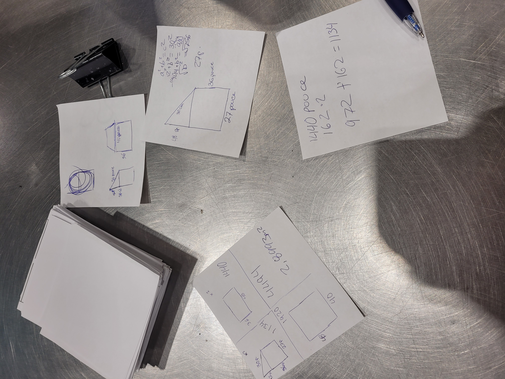
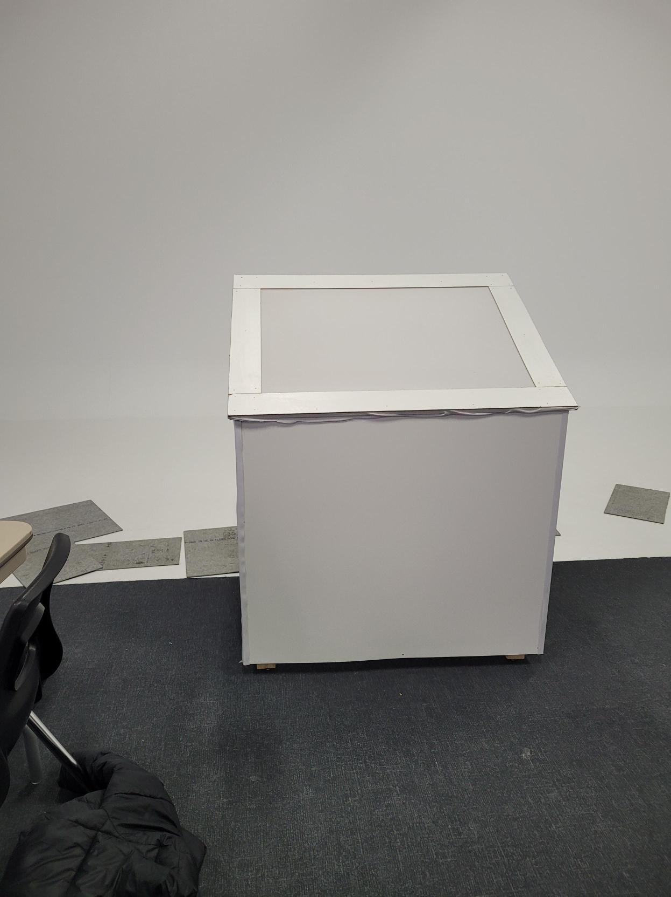
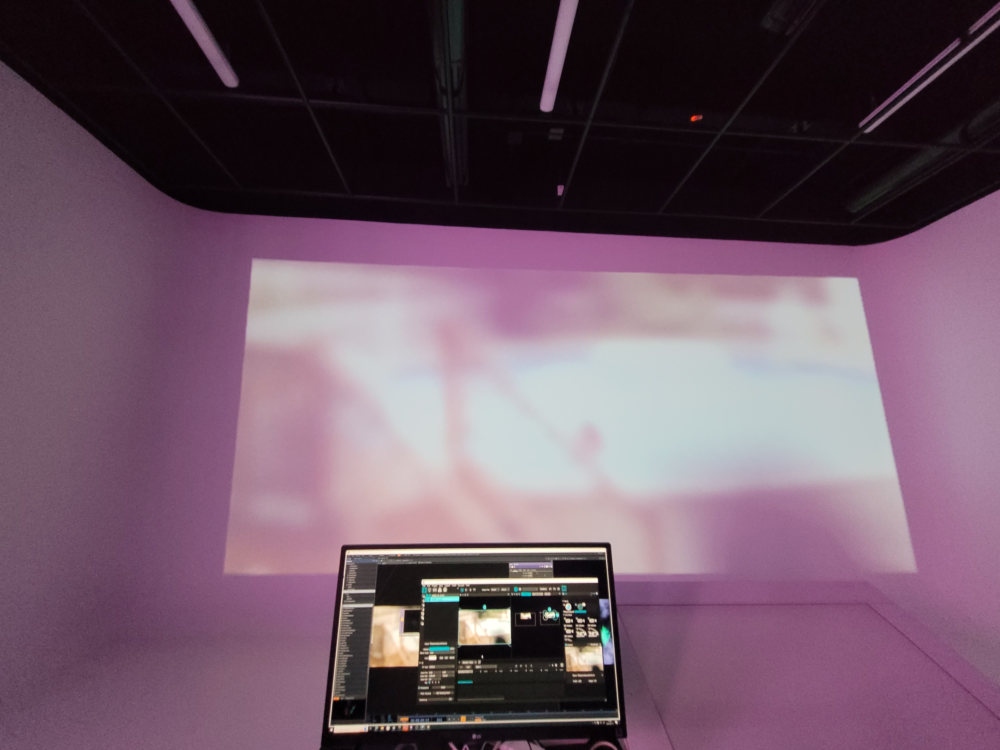
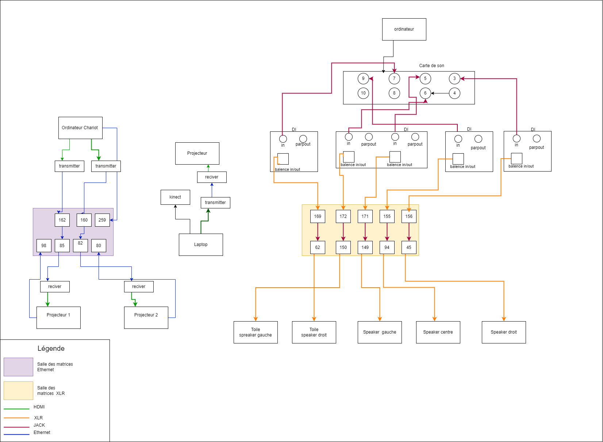
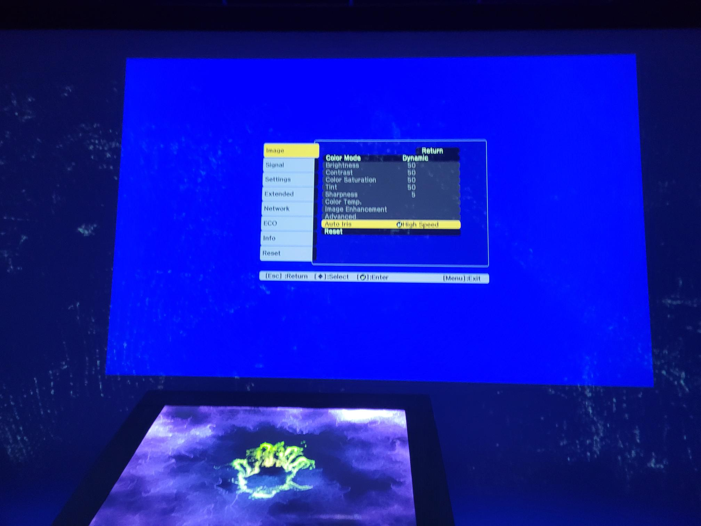

# Journal de "Jolyanne Desjardins"

* [Semaine 1](#semaine-1)
* [Semaine 2](#semaine-2)
* [Semaine 3](#semaine-3)
* [Semaine 4](#semaine-4)
* [Semaine 5](#semaine-5)
* [Semaine 6](#semaine-6)
* [Semaine de rattrapage](#semaine-de-rattrapage)
* [Semaine 7](#semaine-7)
* [Semaine 8](#semaine-8)
* [Semaine 9](#semaine-9)

## Semaine 1

### Résumé des réalisations effectuées
- Écrire les idées de notre version du projet sur Github avec les liens vers les vidéos de référence. 
- Commencer l'échéancier 
- Commencer les plans pour la boite et la toile
  

### Image d'une réalisation dont tu es la ou le plus fier
</img>

### Est-ce que j'ai accompli l'ensemble des tâches et objectifs que je m'étais fixés pour cette semaine?	
- [ ] Complètement
- [x] Assez
- [ ] Peu
- [ ] Pas du tout

#### Décrivez pourquoi.
Pour la planification, avoir un ensemble des dates importantes et pouvoir savoir ce qu'on doit faire à chaque semaine pour ne pas prendre de retard.

### Mon projet s'est-il réalisé selon l’échéancier prévu?

- [ ] Complètement
- [x] Assez
- [ ] Un peu
- [ ] Pas tout à fait

#### S'il y a des écarts, décrivez-les.

#### S'il y a lieu, qu'allez-vous faire pour remédier à la situation?

### Défis pour la prochaine semaine
Installer le projecteur pour projeter sur la toile.

---
## Semaine 2
### Résumé des réalisations effectuées
- J'ai continué à ajouter les infos sur le Github
- Connecter le projecteur avec MadMapper pour afficher la projection sur la toile.
- Commencer la réalisation du logo
- Faire le devoir de Thomas

### Image d'une réalisation dont tu es la ou le plus fier

### Est-ce que j'ai accompli l'ensemble des tâches et objectifs que je m'étais fixés pour cette semaine?

- [x] Complètement
- [ ] Assez
- [ ] Peu
- [ ] Pas du tout

#### Décrivez pourquoi.
 J'ai réussi à projeter la projection de la toile en installant le projecteur ultra wide en le connectant a MadMapper avec OBS.

#### S'il y a lieu, qu'allez-vous faire pour remédier à la situation?

### Mon projet s'est-il réalisé selon l’échéancier prévu?

- [x] Complètement
- [ ] Assez
- [ ] Un peu
- [ ] Pas tout à fait

#### S'il y a des écarts, décrivez-les.

#### S'il y a lieu, qu'allez-vous faire pour remédier à la situation?

### Défis pour la prochaine semaine
Commencer le mapping dans le cyclo

---
## Semaine 3 
### Résumé des réalisations effectuées
- Mapping de la toile
- Arrangement du github
- son de la toile
- Construction de la structure 

### Image d'une réalisation dont tu es la ou le plus fier

</img>

### Est-ce que j'ai accompli l'ensemble des tâches et objectifs que je m'étais fixés pour cette semaine?

- [ ] Complètement
- [x] Assez
- [ ] Peu
- [ ] Pas du tout

#### Décrivez pourquoi.
 Nous avions prévu de commencer le mapping avec les projecteurs sur le cyclo, mais le manque d'internet nous a nui à ce niveau. 

#### S'il y a lieu, qu'allez-vous faire pour remédier à la situation?

### Mon projet s'est-il réalisé selon l’échéancier prévu?

- [x] Complètement
- [ ] Assez
- [ ] Un peu
- [ ] Pas tout à fait

#### S'il y a des écarts, décrivez-les.

#### S'il y a lieu, qu'allez-vous faire pour remédier à la situation?

### Défis pour la prochaine semaine
- Construction de la structure 
- Trouver comment faire tenir la toile étirré 

---
## Semaine 4
### Résumé des réalisations effectuées

- Mapping pour les vidéos projetées sur le mur du centre
- Son de la toile
- Updater le Github
- Son des souvenirs
  

### Image d'une réalisation dont tu es la ou le plus fier

</img>

### Est-ce que j'ai accompli l'ensemble des tâches et objectifs que je m'étais fixés pour cette semaine?

- [ ] Complètement
- [x] Assez
- [ ] Peu
- [ ] Pas du tout

#### Décrivez pourquoi.
Pour la maquette nous aurions voulu avoir le temps de faire le mapping pour les autres murs, mais notre template n'était pas encore pensé donc c'est quelque chose qui va être à faire la semaine prochaine

#### S'il y a lieu, qu'allez-vous faire pour remédier à la situation?
Trouver une manière de faire afficher les vidéos format téléphone sur les murs de côté. 

### Mon projet s'est-il réalisé selon l’échéancier prévu?

- [ ] Complètement
- [x] Assez
- [ ] Un peu
- [ ] Pas tout à fait

#### S'il y a des écarts, décrivez-les.

#### S'il y a lieu, qu'allez-vous faire pour remédier à la situation?

### Défis pour la prochaine semaine
- Faire en sorte que le mapping soit fini
- Que la plupart des vidéos soient dans TouchDesigner
- Le son soit final

---
## Semaine 5
### Résumé des réalisations effectuées
- Effet des vidéos 
- Brancher les haut-parleurs avec le DI
- Son de la toile
- Exporter toutes les vidéos avec Reaper 
- Avancement dans le Github

### Image d'une réalisation dont tu es la ou le plus fier
</img>

### Est-ce que j'ai accompli l'ensemble des tâches et objectifs que je m'étais fixés pour cette semaine?

- [ ] Complètement
- [x] Assez
- [ ] Peu
- [ ] Pas du tout

#### Décrivez pourquoi.
On est quand même bien avancés, mais nous avons eu des problèmes de son avec les vidéos qui on a pris un peu de temps que prévu à régler.

#### S'il y a lieu, qu'allez-vous faire pour remédier à la situation?

### Mon projet s'est-il réalisé selon l’échéancier prévu?

- [ ] Complètement
- [x] Assez
- [ ] Un peu
- [ ] Pas tout à fait

#### S'il y a des écarts, décrivez-les.

#### S'il y a lieu, qu'allez-vous faire pour remédier à la situation?

### Défis pour la prochaine semaine

---
## Semaine 6
### Résumé des réalisations effectuées
- Trouvé des solutions pour la structure de la toile et les bords qui décollent.
- Aidé à l'installation des 2 autres speakers
- Aidé au branchement des fils audio
- Refaite le schéma de branchement
- J'ai aussi réexporté les vidéos une 3e fois à cause des niveaux bizarres de certaines vidéos
- 
### Image d'une réalisation dont tu es la ou le plus fier
Le schéma de branchement 
</img>

### Est-ce que j'ai accompli l'ensemble des tâches et objectifs que je m'étais fixés pour cette semaine?

- [ ] Complètement
- [ ] Assez
- [x] Peu
- [ ] Pas du tout

#### Décrivez pourquoi.
J'aurais dû m'occuper des branchements des fils audio, mais j'ai réglé le problème de la toile en espérant que ça tienne. J'ai aussi fait le schéma de branchement.

#### S'il y a lieu, qu'allez-vous faire pour remédier à la situation?
Essayer d'être capable de comprendre mieu TouchDesigner pour me rendre plus utile

### Mon projet s'est-il réalisé selon l’échéancier prévu?

- [ ] Complètement
- [x] Assez
- [ ] Un peu
- [ ] Pas tout à fait

#### S'il y a des écarts, décrivez-les.

#### S'il y a lieu, qu'allez-vous faire pour remédier à la situation?

### Défis pour la prochaine semaine

Faire la transition vers la salle des matrices!

---
## Semaine de rattrapage
### Résumé des réalisations effectuées
-Aidé pour les problèmes de son 
-Réexportation des sons
-Filage

### Image d'une réalisation dont tu es la ou le plus fier

</img>

### Est-ce que j'ai accompli l'ensemble des tâches et objectifs que je m'étais fixés pour cette semaine?

- [x] Complètement
- [ ] Assez
- [ ] Peu
- [ ] Pas du tout

#### Décrivez pourquoi.
On a même eu droit à une journée de congé vendredi, car le transfert dans la salle des matrices a pris moins de temps que prévu.

#### S'il y a lieu, qu'allez-vous faire pour remédier à la situation?

### Mon projet s'est-il réalisé selon l’échéancier prévu?

- [x] Complètement
- [ ] Assez
- [ ] Un peu
- [ ] Pas tout à fait

#### S'il y a des écarts, décrivez-les.

#### S'il y a lieu, qu'allez-vous faire pour remédier à la situation?

### Défis pour la prochaine semaine
-finir les petits ajustements de détails
---

---
## Semaine 7
### Résumé des réalisations effectuées
-Connexion du 3ème projecteur
-tournage du teaser vidéo 

### Image d'une réalisation dont tu es la ou le plus fier

</img>

### Est-ce que j'ai accompli l'ensemble des tâches et objectifs que je m'étais fixés pour cette semaine?

- [x] Complètement
- [ ] Assez
- [ ] Peu
- [ ] Pas du tout

#### Décrivez pourquoi.
Dernière minute, on a décidé d'utiliser le 3ᵉ projecteur et de le connecter pour les projections du milieu.

#### S'il y a lieu, qu'allez-vous faire pour remédier à la situation?

### Mon projet s'est-il réalisé selon l’échéancier prévu?

- [x] Complètement
- [ ] Assez
- [ ] Un peu
- [ ] Pas tout à fait

#### S'il y a des écarts, décrivez-les.

#### S'il y a lieu, qu'allez-vous faire pour remédier à la situation?

### Défis pour la prochaine semaine
- Faire en sorte que tout marche et qu'il n'y ait pas d'imprévu durant l'exposition.
## Semaine 8

## Semaine 9
