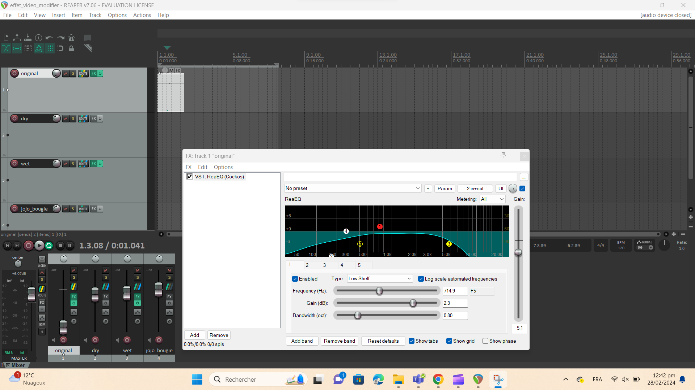

# Journal de "Jolyanne Desjardins"

* [Semaine 1](#semaine-1)
* [Semaine 2](#semaine-2)
* [Semaine 3](#semaine-3)
* [Semaine 4](#semaine-4)
* [Semaine 5](#semaine-5)
* [Semaine 6](#semaine-6)
* [Semaine de rattrapage](#semaine-de-rattrapage)
* [Semaine 7](#semaine-7)
* [Semaine 8](#semaine-8)
* [Semaine 9](#semaine-9)

## Semaine 1

### Résumé des réalisations effectuées
- Écrire les idées de notre version du du projet sur github avec les liens vers les vidéo de référence.
- Commencer l'échéantier
- Commencer les plans pour la boite et la toile
  

### Image d'une réalisation dont tu es la ou le plus fier
</img>

### Est-ce que j'ai accompli l'ensemble des tâches et objectifs que je m'étais fixés pour cette semaine?	
- [ ] Complètement
- [x] Assez
- [ ] Peu
- [ ] Pas du tout

#### Décrivez pourquoi.
Pour la planification avoir un ensemble des dates importantes et pouvoir savoir ce qu'on doit faire à chaque semaine pour pas prendre de retard.

### Mon projet s'est-il réalisé selon l’échéancier prévu?

- [ ] Complètement
- [x] Assez
- [ ] Un peu
- [ ] Pas tout à fait

#### S'il y a des écarts, décrivez-les.

#### S'il y a lieu, qu'allez-vous faire pour remédier à la situation?

### Défis pour la prochaine semaine
Installer le projecteur pour projeter sur la toile

---
## Semaine 2
### Résumé des réalisations effectuées
- J'ai continuer à ajouté les infos sur le github
- Connecter le projecteur avec madmapper pour afficher la projection sur la toile.
- Commencer la réalisation du logo
- Faire le devoir de Thomas

### Image d'une réalisation dont tu es la ou le plus fier

### Est-ce que j'ai accompli l'ensemble des tâches et objectifs que je m'étais fixés pour cette semaine?

- [x] Complètement
- [ ] Assez
- [ ] Peu
- [ ] Pas du tout

#### Décrivez pourquoi.
 J'ai réussi à projeter la projection de la toile en installant le projecteur ultra wide en le connectant a madmapper avec obs.

#### S'il y a lieu, qu'allez-vous faire pour remédier à la situation?

### Mon projet s'est-il réalisé selon l’échéancier prévu?

- [x] Complètement
- [ ] Assez
- [ ] Un peu
- [ ] Pas tout à fait

#### S'il y a des écarts, décrivez-les.

#### S'il y a lieu, qu'allez-vous faire pour remédier à la situation?

### Défis pour la prochaine semaine
Commencer le mapping dans le cyclo

---
## Semaine 3 
### Résumé des réalisations effectuées
- Mapping de la toile
- Arraqngement du github
- son de la toile
- Construction de la structure 

### Image d'une réalisation dont tu es la ou le plus fier

### Est-ce que j'ai accompli l'ensemble des tâches et objectifs que je m'étais fixés pour cette semaine?

- [ ] Complètement
- [x] Assez
- [ ] Peu
- [ ] Pas du tout

#### Décrivez pourquoi.
 Nous avions prévu de commencer le mapping avec les projecteurs sur le cyclo, mais le manque d'internet nous a nuis à ce niveau. 

#### S'il y a lieu, qu'allez-vous faire pour remédier à la situation?

### Mon projet s'est-il réalisé selon l’échéancier prévu?

- [x] Complètement
- [ ] Assez
- [ ] Un peu
- [ ] Pas tout à fait

#### S'il y a des écarts, décrivez-les.

#### S'il y a lieu, qu'allez-vous faire pour remédier à la situation?

### Défis pour la prochaine semaine
- Construction de la structure 
- trouver comment faire tenir la toile étirrer 

---
## Semaine 4
### Résumé des réalisations effectuées

- Mapping pour les vidéo projeter sur le mur du centre
- Son de la toile
- Updater le github
- Son des souvenirs
  

### Image d'une réalisation dont tu es la ou le plus fier

</img>

### Est-ce que j'ai accompli l'ensemble des tâches et objectifs que je m'étais fixés pour cette semaine?

- [ ] Complètement
- [x] Assez
- [ ] Peu
- [ ] Pas du tout

#### Décrivez pourquoi.
 Pour la maquette nous aurions voulu avoir le temps de faire le mapping pour les autres murs mais notre template était pas encore penser donc c'est quelque chose qui va être à faire la semaine prochaine

#### S'il y a lieu, qu'allez-vous faire pour remédier à la situation?
Trouver un manière de faire afficher les vidéos format téléphone sur les murs de côté.

### Mon projet s'est-il réalisé selon l’échéancier prévu?

- [ ] Complètement
- [x] Assez
- [ ] Un peu
- [ ] Pas tout à fait

#### S'il y a des écarts, décrivez-les.

#### S'il y a lieu, qu'allez-vous faire pour remédier à la situation?

### Défis pour la prochaine semaine
Faire en sorte que le mapping soit fini
- Que la plupart des vidéos soit dans touch
- Le son soit final

---
## Semaine 5
### Résumé des réalisations effectuées
-effet des vidéos 
-brancher les haut-parleurs avec le DI
- son de la toile
- exporter toute les vidéo avec reaper 
- avancement dans le github

### Image d'une réalisation dont tu es la ou le plus fier
</img>

### Est-ce que j'ai accompli l'ensemble des tâches et objectifs que je m'étais fixés pour cette semaine?

- [ ] Complètement
- [x] Assez
- [ ] Peu
- [ ] Pas du tout

#### Décrivez pourquoi.
 on est quand même bien avancer mais à cause des problème de son avec les vidéo on a pris un peu de retard dans la gestion des effets des sons pour les vidéos.

#### S'il y a lieu, qu'allez-vous faire pour remédier à la situation?

### Mon projet s'est-il réalisé selon l’échéancier prévu?

- [ ] Complètement
- [x] Assez
- [ ] Un peu
- [ ] Pas tout à fait

#### S'il y a des écarts, décrivez-les.

#### S'il y a lieu, qu'allez-vous faire pour remédier à la situation?

### Défis pour la prochaine semaine

---
## Semaine 6
### Résumé des réalisations effectuées
- Trouver des solutions pour la structure de la toile et les bord qui décolle.
- Aider à l'installation des 2 autres speakers
- Aider au branchement des fils audios

### Image d'une réalisation dont tu es la ou le plus fier

### Est-ce que j'ai accompli l'ensemble des tâches et objectifs que je m'étais fixés pour cette semaine?

- [ ] Complètement
- [] Assez
- [x] Peu
- [ ] Pas du tout

#### Décrivez pourquoi.
 j'Aurais du m'occuper des branchement des fils audio mais j'ai régler le problème de la toile en espérent que sa tienne

#### S'il y a lieu, qu'allez-vous faire pour remédier à la situation?
Essayer d'être capable de comprendre mieu touch pour me rendre plus utile

### Mon projet s'est-il réalisé selon l’échéancier prévu?

- [ ] Complètement
- [ x] Assez
- [ ] Un peu
- [ ] Pas tout à fait

#### S'il y a des écarts, décrivez-les.

#### S'il y a lieu, qu'allez-vous faire pour remédier à la situation?

### Défis pour la prochaine semaine
---
## Semaine de rattrapage
### Résumé des réalisations effectuées

### Image d'une réalisation dont tu es la ou le plus fier

### Est-ce que j'ai accompli l'ensemble des tâches et objectifs que je m'étais fixés pour cette semaine?

- [ ] Complètement
- [ ] Assez
- [ ] Peu
- [ ] Pas du tout

#### Décrivez pourquoi.
 

#### S'il y a lieu, qu'allez-vous faire pour remédier à la situation?

### Mon projet s'est-il réalisé selon l’échéancier prévu?

- [ ] Complètement
- [ ] Assez
- [ ] Un peu
- [ ] Pas tout à fait

#### S'il y a des écarts, décrivez-les.

#### S'il y a lieu, qu'allez-vous faire pour remédier à la situation?

### Défis pour la prochaine semaine

---

---
## Semaine 7
### Résumé des réalisations effectuées

### Image d'une réalisation dont tu es la ou le plus fier

### Est-ce que j'ai accompli l'ensemble des tâches et objectifs que je m'étais fixés pour cette semaine?

- [ ] Complètement
- [ ] Assez
- [ ] Peu
- [ ] Pas du tout

#### Décrivez pourquoi.
 

#### S'il y a lieu, qu'allez-vous faire pour remédier à la situation?

### Mon projet s'est-il réalisé selon l’échéancier prévu?

- [ ] Complètement
- [ ] Assez
- [ ] Un peu
- [ ] Pas tout à fait

#### S'il y a des écarts, décrivez-les.

#### S'il y a lieu, qu'allez-vous faire pour remédier à la situation?

### Défis pour la prochaine semaine

## Semaine 8

## Semaine 9
