# Journal de "Participant 1"

* [Semaine 1](#semaine-1)
* [Semaine 2](#semaine-2)
* [Semaine 3](#semaine-3)
* [Semaine 4](#semaine-4)
* [Semaine 5](#semaine-5)
* [Semaine de rattrapage](#semaine-de-rattrapage)
* [Semaine 6](#semaine-6)
* [Semaine 7](#semaine-7)
* [Semaine 8](#semaine-8)
* [Semaine 9](#semaine-9)

## Semaine 1

### Résumé des réalisations effectuées

- J'ai trouvé une nouvelle idée pour le projet
- J'ai fait des tests sur TouchDesigner
- J'ai créer un groupe sur team pour notre projet. J'ai aussi commencé l'organisation de la semaine en créant une liste de choses à faire pour l'équipe.
- J'ai créé des sons sur VCV RACK 2

### Image d'une réalisation dont tu es la ou le plus fier
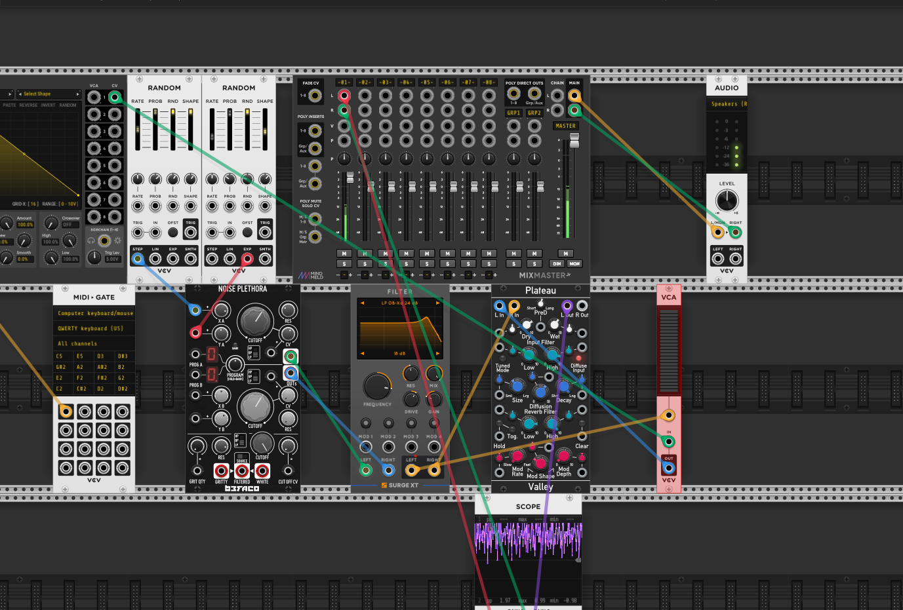
ou
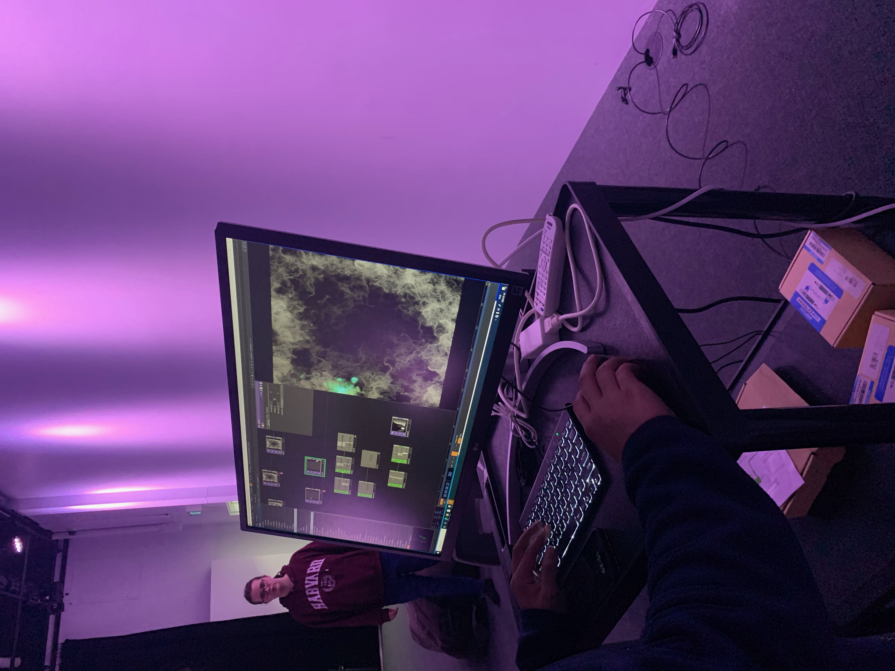

### Est-ce que j'ai accompli l'ensemble des tâches et objectifs que je m'étais fixés pour cette semaine?	
- [ ] Complètement
- [x] Assez
- [ ] Peu
- [ ] Pas du tout

#### Décrivez pourquoi.
C'est la première semaine à l'école donc on est toujours en adaptation. Je me suis mis comme défi la planification de la semaine et de décider des jours de rencontre. On avait aussi chacun comme devoir de faire des tests sur le logiciel TouchDesigner, ce que j'ai également fait. De plus, j'ai commencé à créer des sons dans le logiciel VCV Rack 2 qui sont assez intéressant.

### Mon projet s'est-il réalisé selon l’échéancier prévu?

- [ ] Complètement
- [x] Assez
- [ ] Un peu
- [ ] Pas tout à fait

#### S'il y a des écarts, décrivez-les.
Le seul écart qu'il y a c'est le fait qu'on est toujours pas acheter la toile en spandex extensible.

#### S'il y a lieu, qu'allez-vous faire pour remédier à la situation?

On va acheter la toile mardi.
### Défis pour la prochaine semaine

Mon défi pour la semaine prochaine c'est d'acheter les toiles et de peut être acheté les matériaux nécessaires pour la construction du cadre de la toile. De plus, je vais aussi avoir pour tâche de faire le montage vidéo de notre vidéo qui est à remettre dans une semaine.

---
## Semaine 2
### Résumé des réalisations effectuées

- J'ai fait de la recherche de médias
- J'ai fait de la colo sur DAVinci
- J'ai créé des sons sur VCV RACK 2

Pour la semaine du 29 janvier au 5 février, j'avais pour mission de continuer les sons de notre projet, de trouver des médias qui vont être les souvenirs et de faire le montage vidéo de notre capsule de présentation du projet. J'ai réussi à créer à l'aide d'inspiration un son plutôt intéressant sur VCV Rack 2. De plus, j'ai fini le montage de la capsule. Pour ce qui est des médias, c'est un processus assez long faire le choix des médias, mais ça avance quand même assez bien.

### Image d'une réalisation dont tu es la ou le plus fier

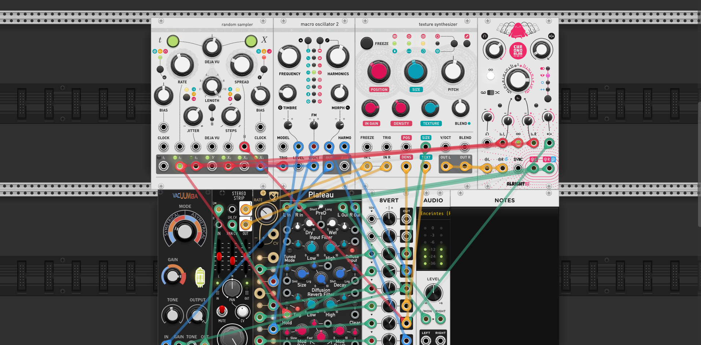
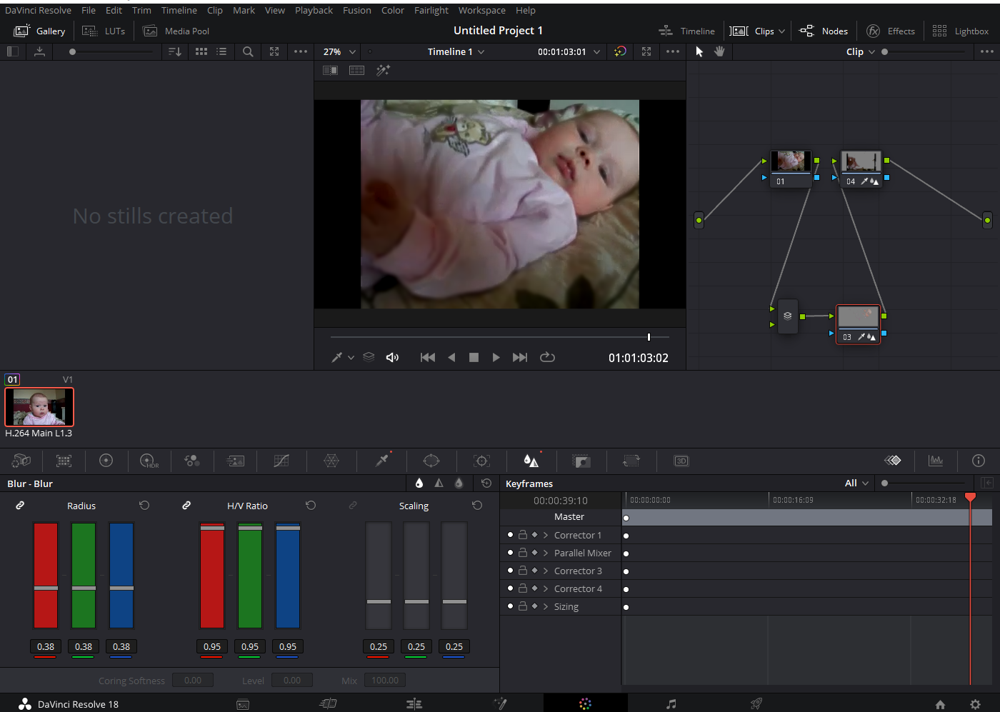

### Est-ce que j'ai accompli l'ensemble des tâches et objectifs que je m'étais fixés pour cette semaine?

- [ ] Complètement
- [ x] Assez
- [ ] Peu
- [ ] Pas du tout

#### Décrivez pourquoi.

Je suis assez satisfaite de ce que j'ai fait cette semaine, car je pense que je suis sur une bonne piste avec les sons. Au début de la semaine, j'étais un peu découragé car je ne savais comment commencer pour la création de son, mais grâce à une vidéo YouTube j'ai réussi à avancer. Pour ce qui est du montage de la capsule ça la été assez rapide. Pour ce qui est du choix des médias c'est un processus quand même long car il y a des vidéos qui datent de très longtemps donc je dois manuellement les converser au bon format pour les rendre utilisables et lisibles par TouchDesigner.
 
#### S'il y a lieu, qu'allez-vous faire pour remédier à la situation?

### Mon projet s'est-il réalisé selon l’échéancier prévu?

- [ ] Complètement
- [x ] Assez
- [ ] Un peu
- [ ] Pas tout à fait

#### S'il y a des écarts, décrivez-les.

#### S'il y a lieu, qu'allez-vous faire pour remédier à la situation?

### Défis pour la prochaine semaine

Mon défi pour la semaine prochaine c'est d'avoir regrouper un bon nombre de médias des membres de l'équipe et de créer encore plus de sons. 

---
## Semaine 3 
### Résumé des réalisations effectuées

- J'ai refais le montage de la vidéo d'intention
- J'ai enregistré le contenu d'une vieille caméra a cassette sur mon disque dur
- J'ai fait des cuts sur DAvinci des vidéos récupéré de la caméra
- J'ai renommer toutes les souvenirs dans un fichier Onedrive

### Image d'une réalisation dont tu es la ou le plus fier

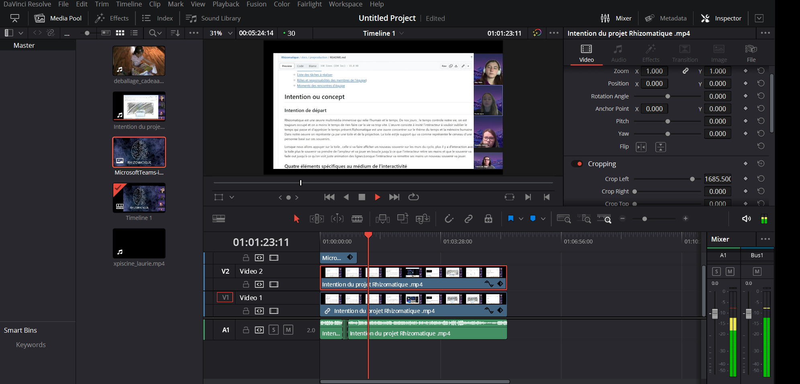
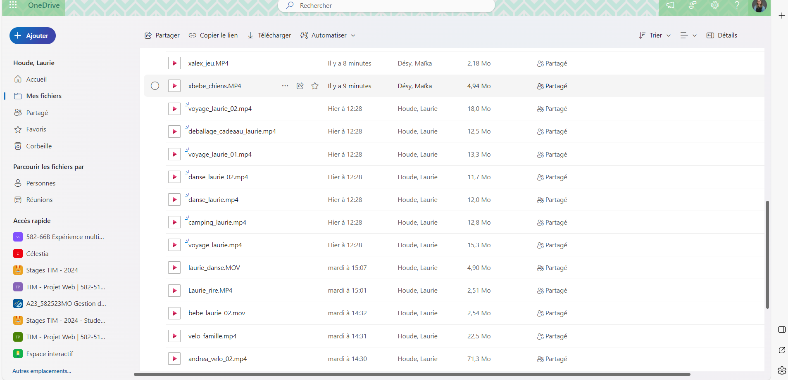

### Est-ce que j'ai accompli l'ensemble des tâches et objectifs que je m'étais fixés pour cette semaine?

- [ ] Complètement
- [ x] Assez
- [ ] Peu
- [ ] Pas du tout

#### Décrivez pourquoi.

J'ai bien avancé cette semaine. J'ai fini le son ambiant de l'oeuvre et grâce à OBS j'ai enregistré le contenu de la caméra à cassette. Ensuite, j'ai été dans le logiciel DAvinci et j'ai coupé des bouts de vidéos de 20 secondes qui vont nous servir pour les souvenirs. Pour finir, j'ai retravaillé la vidéo d'intention pour la rendre meilleure encore.

#### S'il y a lieu, qu'allez-vous faire pour remédier à la situation?

### Mon projet s'est-il réalisé selon l’échéancier prévu?

- [ ] Complètement
- [x ] Assez
- [ ] Un peu
- [ ] Pas tout à fait

#### S'il y a des écarts, décrivez-les.

Il y a un ralentissement dans la recherche de média, car on a réalisé qu'il manquait de vidéo plus récente (filmé avec un téléphone). 

#### S'il y a lieu, qu'allez-vous faire pour remédier à la situation?

On a du faire une recherche encore plus approfondie pour trouver de nous médias

### Défis pour la prochaine semaine

Pour la semaine prochaine, je me met au défi d'installer les projecteurs au plafond et de faire le filage au plafond.

---
## Semaine 4
### Résumé des réalisations effectuées

- J'ai accroché un projecteur
- J'ai fait tout le filage du projecteur
- J'ai modifié le sons des vidéo sur Reaper
- ajout des haut-parleurs au sol

La semaine 4 était la semaine des installations. J'ai beaucoup contribué à cette partie pour le projet. En effet, je suis monté dans l'échelle, j'ai installé les projecteurs et j'ai fait le filage avec ma collègue Maika. De plus, j'ai ajouté les haut-parleurs du sol et j'ai fait le filage.

### Image d'une réalisation dont tu es la ou le plus fier

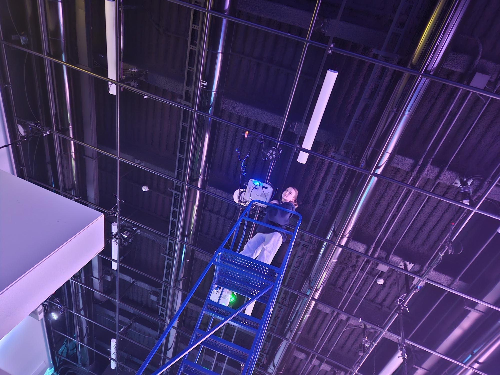

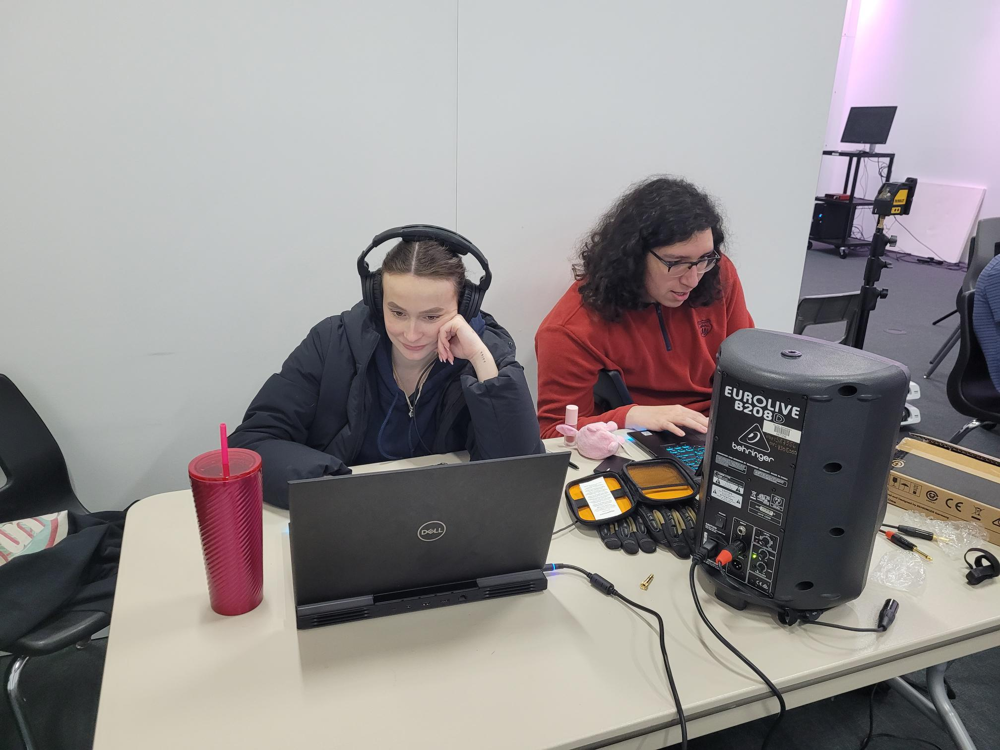

### Est-ce que j'ai accompli l'ensemble des tâches et objectifs que je m'étais fixés pour cette semaine?

- [x ] Complètement
- [ ] Assez
- [ ] Peu
- [ ] Pas du tout

#### Décrivez pourquoi.

 Je suis très fière de moi, car j'ai vaincu ma peur des hauteurs en montant dans l'échelle et installant des projecteurs. J'ai beaucoup aidé mon équipe à ce niveau car on est nombreux à avoir la peur des hauteurs dans mon équipe.

#### S'il y a lieu, qu'allez-vous faire pour remédier à la situation?

### Mon projet s'est-il réalisé selon l’échéancier prévu?

- [ ] Complètement
- [ ] Assez
- [ ] Un peu
- [ ] Pas tout à fait

#### S'il y a des écarts, décrivez-les.

Trouver la bonne position pour les projecteurs a été un gros défi, car on ne savait pas si on disposait les projecteurs à la verticale au lieu de l'horizontale. Il y a avait beaucoup de possibilités, mais aucune d'entre elles ne donnaient exactement ce qu'on voulait.

#### S'il y a lieu, qu'allez-vous faire pour remédier à la situation?

Finalement, on est allé parler aux professeurs et on a conclu que c'était d'avoir un projecteur par-dessus l'autre et que le projecteur du dessous est un angle penché vers le haut.

### Défis pour la prochaine semaine
---
Pour la semaine prochaine,je me mets au défi de retravailler le son de la toile pour créer plus de mouvement et dimension lorsque tu appuies sur la toile.

## Semaine 5
### Résumé des réalisations effectuées

- ajout du haut-parleur (milieu) au plafond
- j'ai refait le son de la toile
- Faire le filage

### Image d'une réalisation dont tu es la ou le plus fier

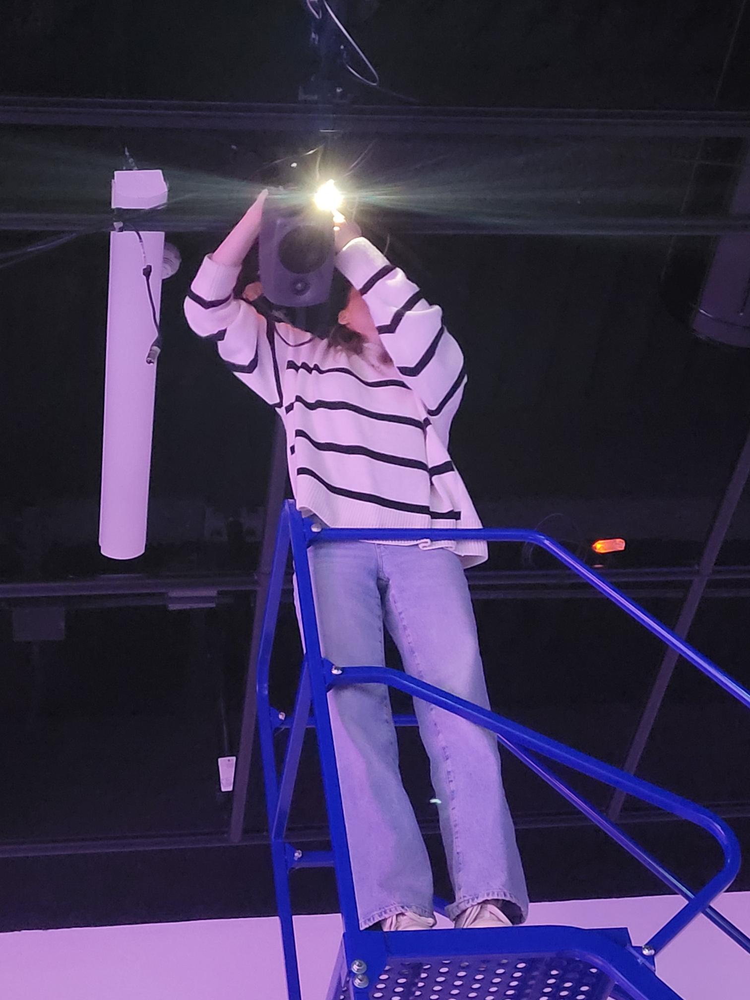

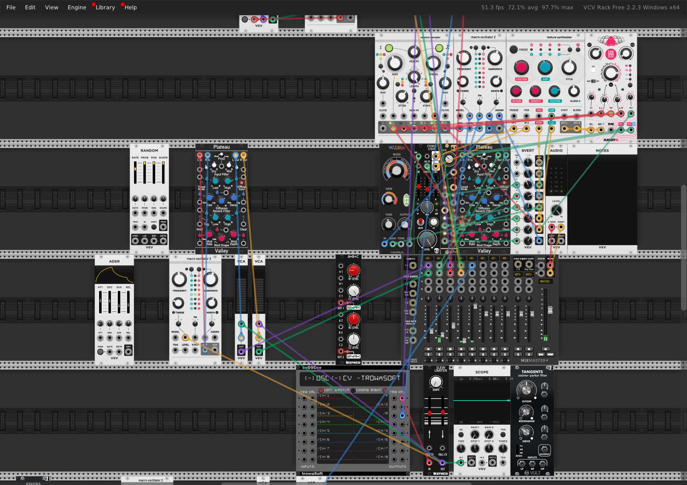

### Est-ce que j'ai accompli l'ensemble des tâches et objectifs que je m'étais fixés pour cette semaine?

- [ x] Complètement
- [ ] Assez
- [ ] Peu
- [ ] Pas du tout

#### Décrivez pourquoi.

 J'ai travaillé très fort dans l'installation des haut-parleurs, dans leur fonctionnement et dans le filage. J'ai aussi refait le son de la toile afin qu'il soit plus adapté aux sons d'ambiance du projet. Je suis très fier du résultat ça complète vraiment le projet.On a eu quelques complications avec l'ajout du haut-parleur au plafond, car on ne savait pas où le mettre. On hésitait entre au sol en avant de la structure de la toile ou au plafond au dessus de la toile. De base je l'ai essayé au sol, mais avec les portes ouvertes j'ai réalisé que ce n'était pas la meilleure place. En effet, les personnes qui testaient la toile ne regardait que la toile et pas les projections.

#### S'il y a lieu, qu'allez-vous faire pour remédier à la situation?

Pour remédier à la situation, on a installé le haut-parleur au plafond. De cette façon les gens sont attirés vers le son du plafond et regarde davantages les projections.

### Mon projet s'est-il réalisé selon l’échéancier prévu?

- [ ] Complètement
- [ x] Assez
- [ ] Un peu
- [ ] Pas tout à fait

#### S'il y a des écarts, décrivez-les.

On a eu quelques problèmes au niveau des sons des vidéos car il y'a des sons plus fort que d'autres et le contraste est trop gros. 

#### S'il y a lieu, qu'allez-vous faire pour remédier à la situation?

Il faut ajuster les sons des vidéos dans Reaper et les réexporter.

### Défis pour la prochaine semaine

Pour la semaine prochaine, je me donne pour défi d'installer deux autres haut-parleurs au plafond , de faire le filage et d'ajouter les DI à la carte de son.

---
## Semaine 6
### Résumé des réalisations effectuées

- Installer deux haut-parleurs au plafond
- Ajout des boîtes DI
- Changer de carte de sons
- Filage des haut-parleurs
- Le focus des projecteurs

### Image d'une réalisation dont tu es la ou le plus fier

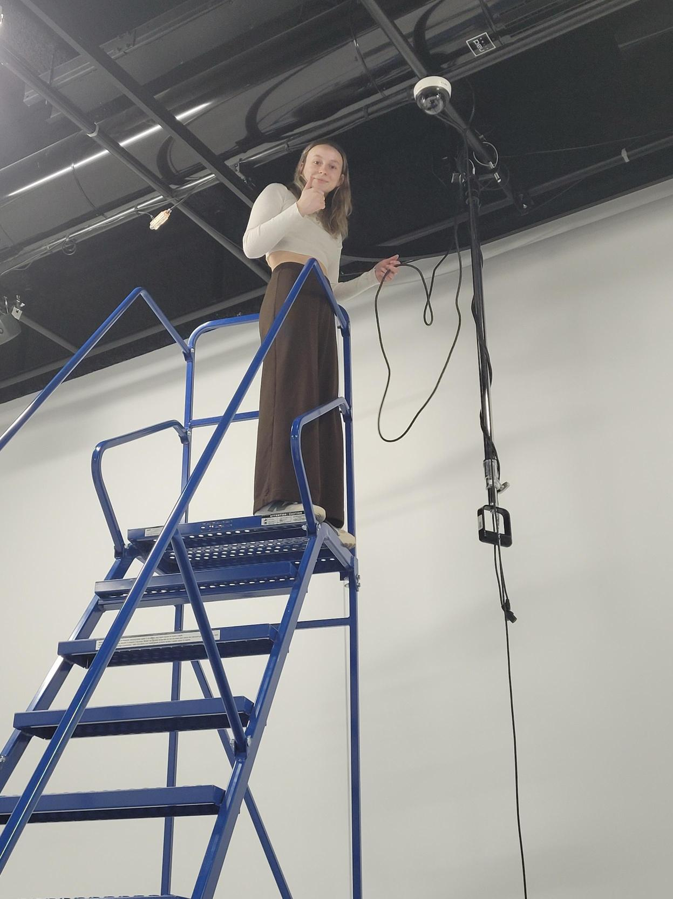

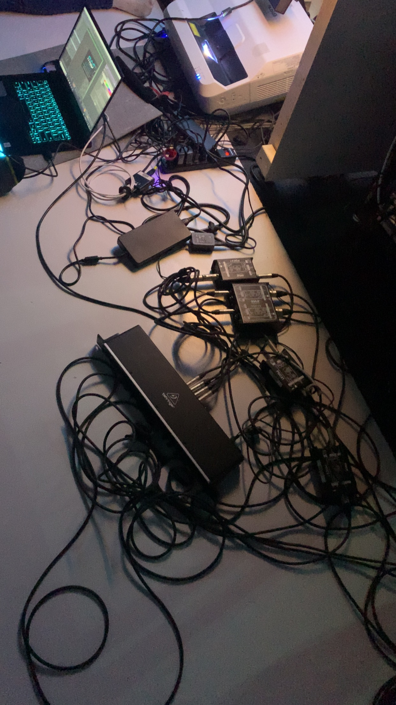

### Est-ce que j'ai accompli l'ensemble des tâches et objectifs que je m'étais fixés pour cette semaine?

- [x ] Complètement
- [ ] Assez
- [ ] Peu
- [ ] Pas du tout

#### Décrivez pourquoi.

J'ai été très productive pendant la semaine 6. J'ai installé deux nouveau haut-parleurs au plafond et fait le filage (un à gauche et un à droite). J'ai aussi changé la carte de son pour une plus grosse car ils n'y avaient pu assez de sorties audios pour les cinq haut-parleurs qu'on utilisait. De plus j'ai aussi ajouter des boîtes DI pour avoir un meilleur son quand on va être rendu à déplacer l'ordinateur dans la salle des matrices.

#### S'il y a lieu, qu'allez-vous faire pour remédier à la situation?

### Mon projet s'est-il réalisé selon l’échéancier prévu?

- [ ] Complètement
- [ x] Assez
- [ ] Un peu
- [ ] Pas tout à fait

#### S'il y a des écarts, décrivez-les.

J'ai rencontré quelques problème pendant la semaine 6 concernant les haut-parleurs. En effet, j'ai réaliser que quand tu arrêtais de sortir du son dans le haut-parleur gauche et le droit ils s'éteignaient. Donc à chaque qu'il s'éteignaient je devais prendre l'échelle l'amener dans le cyclo et rallumer les deux haut-parleurs plusieurs fois dans une journée. Un autre problème que j'ai rencontré c'est que les haut-parleurs du plafond grichaient à chaque qu'on mettait notre main sur la toile et qu'on la retirait. 

#### S'il y a lieu, qu'allez-vous faire pour remédier à la situation?

Pour régler le problème des haut-parleurs qui s'éteingne lorsque tu ne l'ai utilise pas pendant un moment, j'ai été voir Antoine et Guillaume pour comprendre ce qu'il se passait. Après avoir lu de la documentation on a réalisé qu'avec cette sorte de haut-parleur là quand tu cesses de les utiliser pendant un moment il tombe dans un mode sleep. Pour remédier à la situation j'ai du décrocher les haut-parleur et enlever une pièce pour pouvoir accéder à un petit panneau qui nous permet de désactiver ce mode. En l'ai réinstallant on a réalisé que le problème était régler. Pour ce qui est du deuxième problème, on est encore entrain d'essayer de comprendre la cause.

### Défis pour la prochaine semaine

Régler le son qui griches et faire le filage pour amener l'ordi dans la salle des matrices.

---
## Semaine de rattrapage

### Résumé des réalisations effectuées

-Filage
-organisation du budget pour mon comité

### Image d'une réalisation dont tu es la ou le plus fier

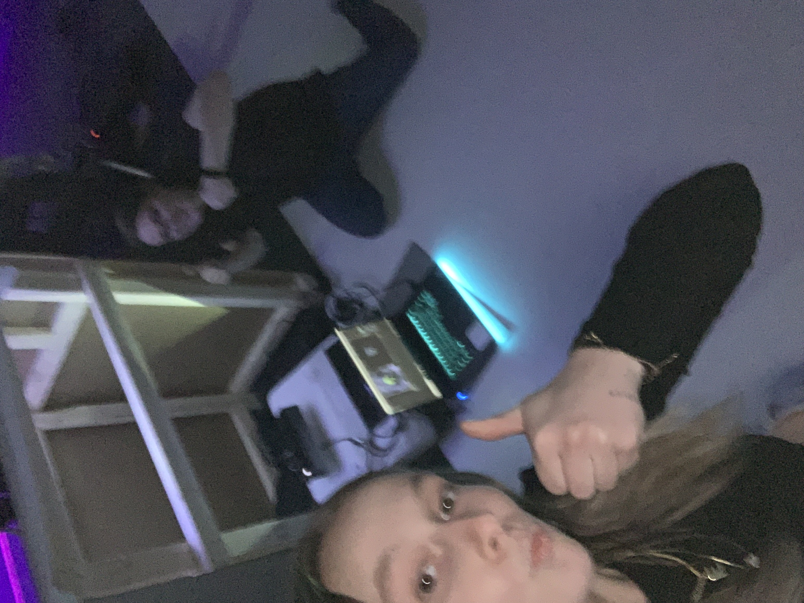
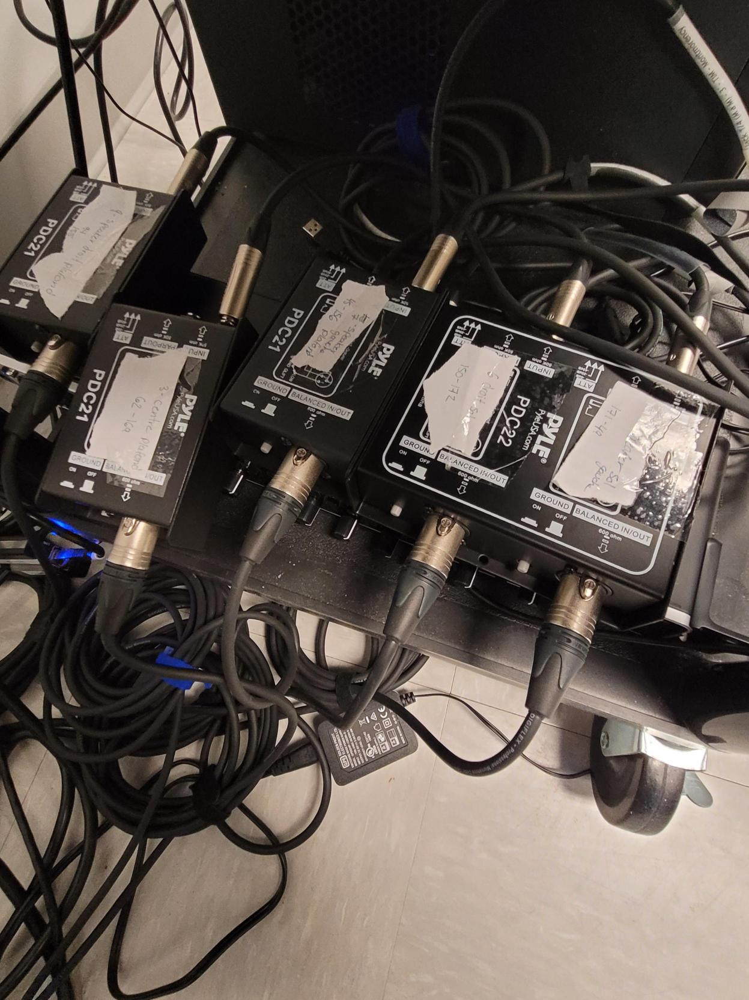

### Est-ce que j'ai accompli l'ensemble des tâches et objectifs que je m'étais fixés pour cette semaine?

- [ ] Complètement
- [ ] Assez
- [x ] Peu
- [ ] Pas du tout

#### Décrivez pourquoi.
 
On étaient bien avancé dans le projet donc on c'est permis quelques jours de congés.

#### S'il y a lieu, qu'allez-vous faire pour remédier à la situation?

On va travailler plus fort la semaine prochaine.

### Mon projet s'est-il réalisé selon l’échéancier prévu?

- [ x] Complètement
- [ ] Assez
- [ ] Un peu
- [ ] Pas tout à fait

#### S'il y a des écarts, décrivez-les.

On avait rencontré quelques problèmes avec mes haut-parleurs la semaine passé et on penssait régler ça très rapidement pendant la semiane de relâche. Cependant, on a réalisé que le problème était un peu plus compliqué qu'on penssait. On a contacté Thomas et il nous a aidé à régler le problème à distance.

#### S'il y a lieu, qu'allez-vous faire pour remédier à la situation?

### Défis pour la prochaine semaine

Pour la semaine prochaine, je vais essayer de bouger les choses dans comité pour du budget et de trouver une solution si on arrive pas a voir du financement.

---

## Semaine 7
### Résumé des réalisations effectuées

-Vidéo promotionnelle pour la technique
-tournage pour la video promotionnelle du projet 
-Vidéo promotionnelle pour notre projet

### Image d'une réalisation dont tu es la ou le plus fier

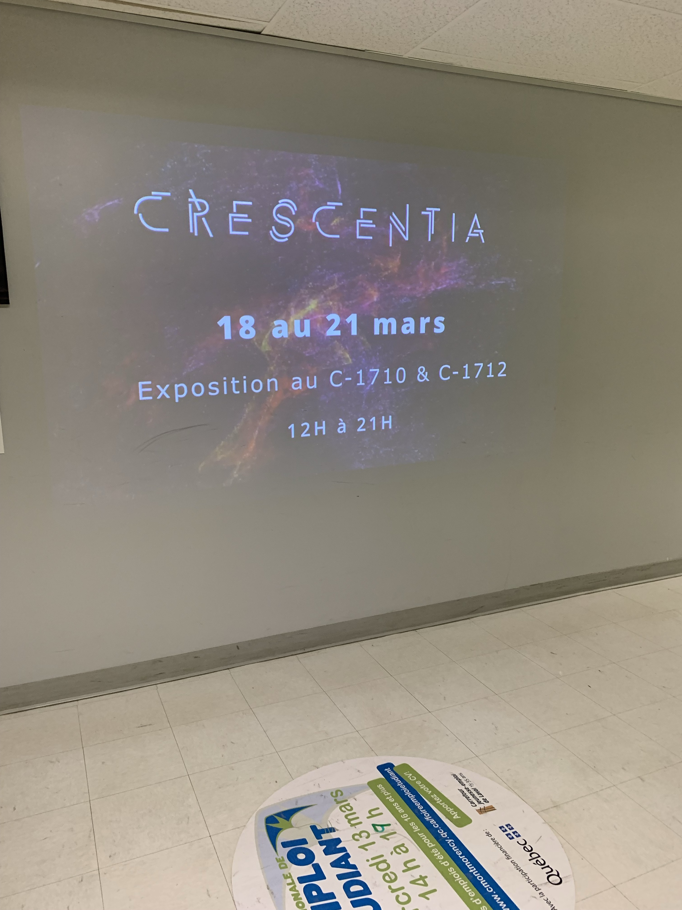
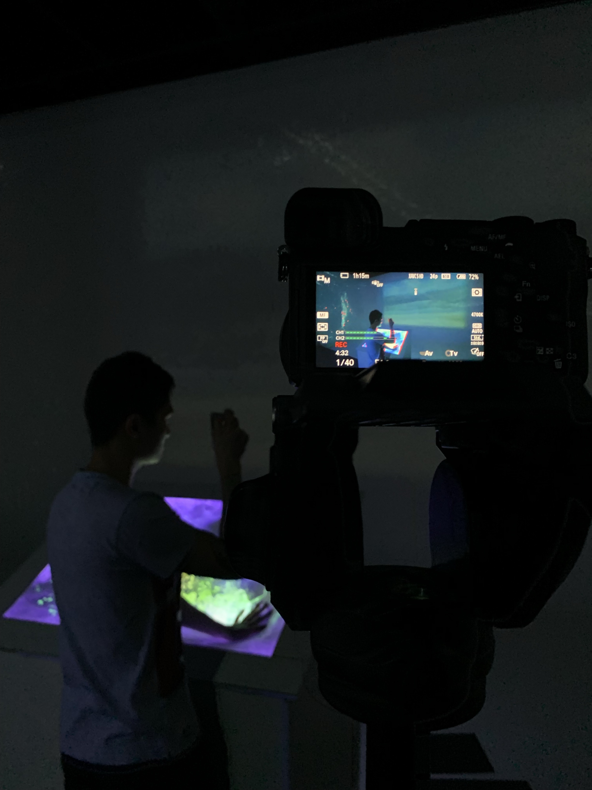
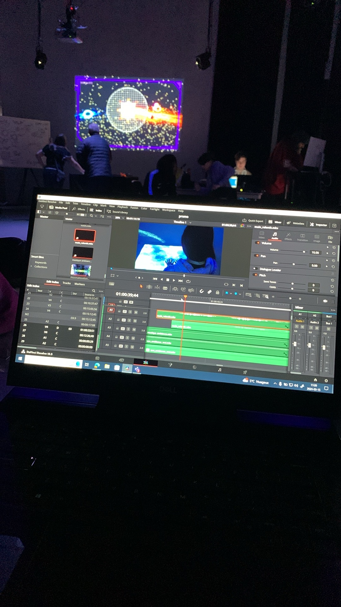

### Est-ce que j'ai accompli l'ensemble des tâches et objectifs que je m'étais fixés pour cette semaine?

- [x ] Complètement
- [ ] Assez
- [ ] Peu
- [ ] Pas du tout

#### Décrivez pourquoi.
 J'ai travaillé très fort cette semaine pour rendre à temps mes différents montages vidéos. Cette semaine, j'ai aidé le comité publicité en faisant une vidéo publicitaire pour annoncer l'exposition qui va être affiché sur les télévisions et projeter sur un mur du collège. Par la suite, mercredi matin moi et Jolyanne sommes arrivés tôt au cégep pour tourner du contenu visuel de notre installation pour notre vidéo publicitaire. Ensuite, j'ai fait le montage de la vidéo jeudi.

#### S'il y a lieu, qu'allez-vous faire pour remédier à la situation?

### Mon projet s'est-il réalisé selon l’échéancier prévu?

- [ ] Complètement
- [ ] Assez
- [ ] Un peu
- [ ] Pas tout à fait

#### S'il y a des écarts, décrivez-les.

#### S'il y a lieu, qu'allez-vous faire pour remédier à la situation?

### Défis pour la prochaine semaine

## Semaine 8

## Semaine 9
