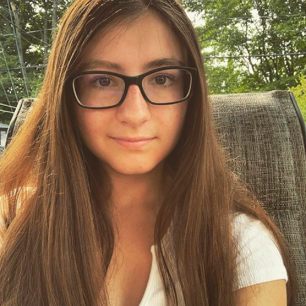

# Journal de "Maïka Désy"

* [Semaine 1](#semaine-1)
* [Semaine 2](#semaine-2)
* [Semaine 3](#semaine-3)
* [Semaine 4](#semaine-4)
* [Semaine 5](#semaine-5)
* [Semaine de rattrapage](#semaine-de-rattrapage)
* [Semaine 6](#semaine-6)
* [Semaine 7](#semaine-7)
* [Semaine 8](#semaine-8)
* [Semaine 9](#semaine-9)

## Semaine 1

### Résumé des réalisations effectuées
- J'ai fait un test de modèle artistique.
- J'ai créer un deuxième modèle artistique pour le mur et cette fois-ci le vrai.
- J'ai rajouté une détection avec la souris pour.

### Image d'une réalisation dont tu es la ou le plus fier

ou

### Est-ce que j'ai accompli l'ensemble des tâches et objectifs que je m'étais fixés pour cette semaine?	
- [ ] Complètement
- [x] Assez
- [ ] Peu
- [ ] Pas du tout

#### Décrivez pourquoi.
Le bus étais de réaliser un modèle artistique selon ce que nous voulions et j'ai fait lui qui sera projeter au mur alors la tâche est assez accomplie, Mais il reste à le synchroniser avec celui de la toile.

#### S'il y a lieu, qu'allez-vous faire pour remédier à la situation?
Nous ferons probablement des tests la semaine prochaine pour voir si on peut synchroniser le modèle artistique de la toile avec lui du mur.

### Mon projet s'est-il réalisé selon l’échéancier prévu?

- [ ] Complètement
- [x] Assez
- [ ] Un peu
- [ ] Pas tout à fait

#### S'il y a des écarts, décrivez-les.
il n'y a pas d'écart pour le moment.

### Défis pour la prochaine semaine
Essayer de syncroniser le modèle artistique de la toile avec lui du mur.

---
## Semaine 2
### Résumé des réalisations effectuées
- J'ai refais le modèle artistique pour la projection au mur.
- J'ai créer plusieurs modèle différent.
- J'ai rajouter des vidéo par dessus.
- J'ai fait en sorte qu'on puisse changer les images.

### Image d'une réalisation dont tu es la ou le plus fier

### Est-ce que j'ai accompli l'ensemble des tâches et objectifs que je m'étais fixés pour cette semaine?

- [ ] Complètement
- [x] Assez
- [ ] Peu
- [ ] Pas du tout

#### Décrivez pourquoi.
 On a réussi à synchronyser les deux modèle artistique ensemble mais on à pas encore fait en sorte que les images change d'une à l'autre en touchant la toile.

#### S'il y a lieu, qu'allez-vous faire pour remédier à la situation?
On va probablement essayer de les connecter ensembles.

### Mon projet s'est-il réalisé selon l’échéancier prévu?

- [ ] Complètement
- [x] Assez
- [ ] Un peu
- [ ] Pas tout à fait

#### S'il y a des écarts, décrivez-les.
Il n'y a pas d'écarts.

### Défis pour la prochaine semaine
Faire en sorte les images change sur le mur lorsque l'on touche la toile et monter le projecteur au plafond.

---
## Semaine 3 
### Résumé des réalisations effectuées
- J'ai réussie à faire en sorte que les média soit aléatoire et que cela s'enclenche avec la toile.
- J'ai mis les vrai médias de souvenirs.

### Est-ce que j'ai accompli l'ensemble des tâches et objectifs que je m'étais fixés pour cette semaine?

- [ ] Complètement
- [x] Assez
- [ ] Peu
- [ ] Pas du tout

#### Décrivez pourquoi.
 J'ai réussi à mettre les vidéos aléatoire et les afficher en fonction qu'on appuie sur la toile, mais on à pas encore placé les projecteurs, alors je n'ai pas adapter la projection.

#### S'il y a lieu, qu'allez-vous faire pour remédier à la situation?
Cette semaine nous allons accrocher le projecteurs au plafond.

### Mon projet s'est-il réalisé selon l’échéancier prévu?

- [ ] Complètement
- [ ] Assez
- [x] Un peu
- [ ] Pas tout à fait

#### S'il y a des écarts, décrivez-les.
Le projecteur n'ais pas accroché au plafond.

#### S'il y a lieu, qu'allez-vous faire pour remédier à la situation?
Cette semaine nous allons l'accrocher.

### Défis pour la prochaine semaine
Je vais rajouter des lignes lorsque l'oeuvre est au repos.

---
## Semaine 4
### Résumé des réalisations effectuées
J'ai installé les projecteurs j'ai rajouté l'effet visuel au mur lorsque l'oeuvre est en repos.

### Image d'une réalisation dont tu es la ou le plus fier

### Est-ce que j'ai accompli l'ensemble des tâches et objectifs que je m'étais fixés pour cette semaine?

- [x] Complètement
- [ ] Assez
- [ ] Peu
- [ ] Pas du tout

#### Décrivez pourquoi.
 les projecteurs sont accroché et j'ai fait l'effet visuelle au repos.

### Mon projet s'est-il réalisé selon l’échéancier prévu?

- [x] Complètement
- [ ] Assez
- [ ] Un peu
- [ ] Pas tout à fait

### Défis pour la prochaine semaine

Installer les hauts-parleurs, mettre tous les vidéos de souvenirs et programer le sons à l'oeuvre.

---
## Semaine 5
### Résumé des réalisations effectuées
-J'ai mis les vidéos sur les trois murs

### Image d'une réalisation dont tu es la ou le plus fier

### Est-ce que j'ai accompli l'ensemble des tâches et objectifs que je m'étais fixés pour cette semaine?

- [ ] Complètement
- [ ] Assez
- [x] Peu
- [ ] Pas du tout

#### Décrivez pourquoi.
 les vidéos ne sont pas toute là et il faut couper certaine vidéos

#### S'il y a lieu, qu'allez-vous faire pour remédier à la situation?
cette semaine il faut toutes les mettrent

### Mon projet s'est-il réalisé selon l’échéancier prévu?

- [ ] Complètement
- [ ] Assez
- [x] Un peu
- [ ] Pas tout à fait

#### S'il y a des écarts, décrivez-les.
les vidéos ne sont pas toutes là donc les sons aussi.

#### S'il y a lieu, qu'allez-vous faire pour remédier à la situation?
Il faut absolument les mettrent cette semaine.

### Défis pour la prochaine semaine
Mettre toutes les vidéos et mettre les bons sons pour chacun.

---
## Semaine de rattrapage
### Résumé des réalisations effectuées

### Image d'une réalisation dont tu es la ou le plus fier

### Est-ce que j'ai accompli l'ensemble des tâches et objectifs que je m'étais fixés pour cette semaine?

- [ ] Complètement
- [ ] Assez
- [ ] Peu
- [ ] Pas du tout

#### Décrivez pourquoi.
 

#### S'il y a lieu, qu'allez-vous faire pour remédier à la situation?

### Mon projet s'est-il réalisé selon l’échéancier prévu?

- [ ] Complètement
- [ ] Assez
- [ ] Un peu
- [ ] Pas tout à fait

#### S'il y a des écarts, décrivez-les.

#### S'il y a lieu, qu'allez-vous faire pour remédier à la situation?

### Défis pour la prochaine semaine

---
## Semaine 6
### Résumé des réalisations effectuées

### Image d'une réalisation dont tu es la ou le plus fier

### Est-ce que j'ai accompli l'ensemble des tâches et objectifs que je m'étais fixés pour cette semaine?

- [ ] Complètement
- [ ] Assez
- [ ] Peu
- [ ] Pas du tout

#### Décrivez pourquoi.
 

#### S'il y a lieu, qu'allez-vous faire pour remédier à la situation?

### Mon projet s'est-il réalisé selon l’échéancier prévu?

- [ ] Complètement
- [ ] Assez
- [ ] Un peu
- [ ] Pas tout à fait

#### S'il y a des écarts, décrivez-les.

#### S'il y a lieu, qu'allez-vous faire pour remédier à la situation?

### Défis pour la prochaine semaine

---
## Semaine 7
### Résumé des réalisations effectuées

### Image d'une réalisation dont tu es la ou le plus fier

### Est-ce que j'ai accompli l'ensemble des tâches et objectifs que je m'étais fixés pour cette semaine?

- [ ] Complètement
- [ ] Assez
- [ ] Peu
- [ ] Pas du tout

#### Décrivez pourquoi.
 

#### S'il y a lieu, qu'allez-vous faire pour remédier à la situation?

### Mon projet s'est-il réalisé selon l’échéancier prévu?

- [ ] Complètement
- [ ] Assez
- [ ] Un peu
- [ ] Pas tout à fait

#### S'il y a des écarts, décrivez-les.

#### S'il y a lieu, qu'allez-vous faire pour remédier à la situation?

### Défis pour la prochaine semaine

## Semaine 8

## Semaine 9
