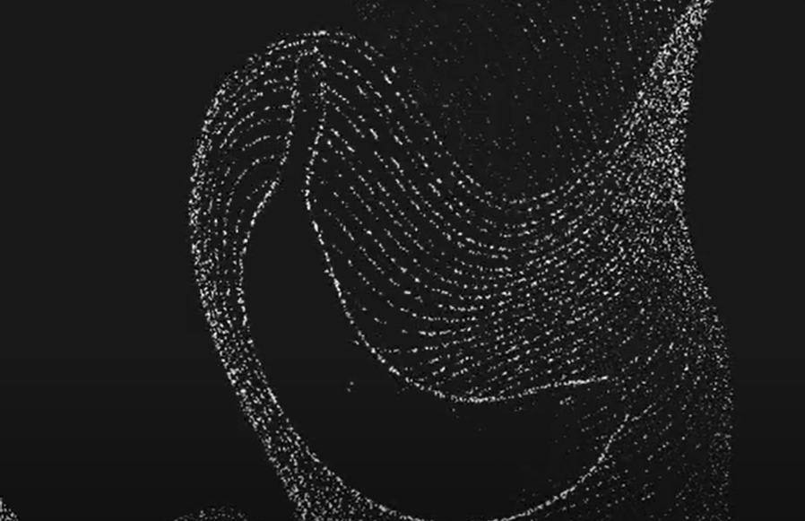
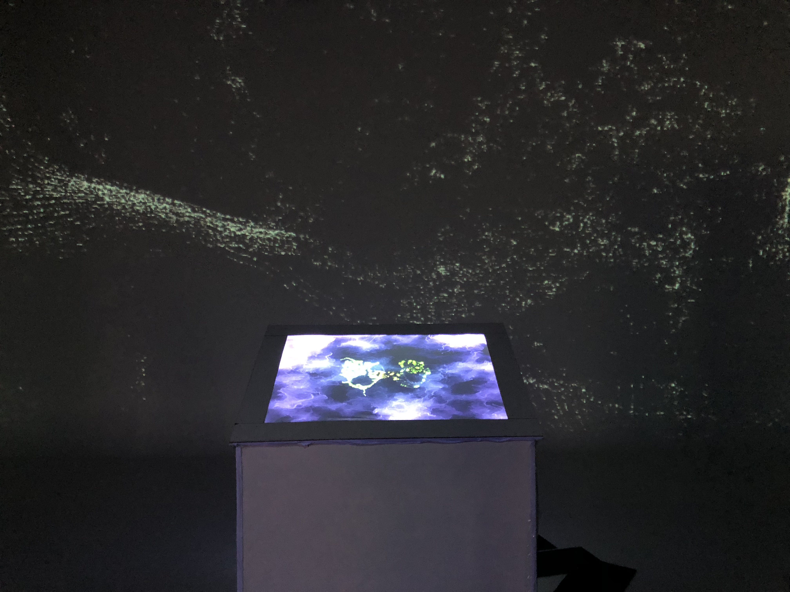

# Journal de "Maïka Désy"

* [Semaine 1](#semaine-1)
* [Semaine 2](#semaine-2)
* [Semaine 3](#semaine-3)
* [Semaine 4](#semaine-4)
* [Semaine 5](#semaine-5)
* [Semaine de rattrapage](#semaine-de-rattrapage)
* [Semaine 6](#semaine-6)
* [Semaine 7](#semaine-7)
* [Semaine 8](#semaine-8)
* [Semaine 9](#semaine-9)

## Semaine 1

### Résumé des réalisations effectuées
- J'ai fait un test de modèle artistique.
- J'ai créé un deuxième modèle artistique pour le mur et cette fois-ci le vrai.
- J'ai rajouté une détection avec la souris pour.

### Image d'une réalisation dont tu es la ou le plus fier

ou

### Est-ce que j'ai accompli l'ensemble des tâches et objectifs que je m'étais fixés pour cette semaine?	
- [ ] Complètement
- [x] Assez
- [ ] Peu
- [ ] Pas du tout

#### Décrivez pourquoi.
Le but était de réaliser un modèle artistique selon ce que nous voulions et j'ai fait celui qui sera projeté au mur. Alors, la tâche est assez accomplète, mais il reste à le synchroniser avec celui de la toile.

#### S'il y a lieu, qu'allez-vous faire pour remédier à la situation?
Nous ferons probablement des tests la semaine prochaine pour voir si on peut synchroniser le modèle artistique de la toile avec lui du mur.

### Mon projet s'est-il réalisé selon l’échéancier prévu?

- [ ] Complètement
- [x] Assez
- [ ] Un peu
- [ ] Pas tout à fait

#### S'il y a des écarts, décrivez-les.
Il n'y a pas d'écarts pour le moment.

### Défis pour la prochaine semaine
Essayer de synchroniser le modèle artistique de la toile avec lui du mur.

---
## Semaine 2
### Résumé des réalisations effectuées
- J'ai refait le modèle artistique pour la projection au mur.
- J'ai créé plusieurs modèles différents.
- J'ai rajouté des vidéos par-dessus.
- J'ai fait en sorte qu'on puisse changer les images.

### Image d'une réalisation dont tu es la ou le plus fier

### Est-ce que j'ai accompli l'ensemble des tâches et objectifs que je m'étais fixés pour cette semaine?

- [ ] Complètement
- [x] Assez
- [ ] Peu
- [ ] Pas du tout

#### Décrivez pourquoi.
On a réussi à synchroniser les deux modèles artistiques ensemble mais nous n'avions pas encore fait en sorte que les images changent d'une à l'autre en touchant la toile.

#### S'il y a lieu, qu'allez-vous faire pour remédier à la situation?
Nous allons probablement essayer de les connecter ensembles.

### Mon projet s'est-il réalisé selon l’échéancier prévu?

- [ ] Complètement
- [x] Assez
- [ ] Un peu
- [ ] Pas tout à fait

#### S'il y a des écarts, décrivez-les.
Il n'y a pas d'écarts.

### Défis pour la prochaine semaine
Faire en sorte les images change sur le mur lorsque l'on touche la toile et monter le projecteur au plafond.

---
## Semaine 3 
### Résumé des réalisations effectuées
- J'ai réussi à faire en sorte que les médias soient aléatoires et que cela s'enclenche avec la toile.
- J'ai mis les vrais médias de souvenirs.

### Est-ce que j'ai accompli l'ensemble des tâches et objectifs que je m'étais fixés pour cette semaine?

- [ ] Complètement
- [x] Assez
- [ ] Peu
- [ ] Pas du tout

#### Décrivez pourquoi.
J'ai réussi à mettre les vidéos aléatoires et les afficher en fonction qu'on appuie sur la toile, mais on n'a pas encore placé les projecteurs, alors je n'ai pas adapté la projection.

#### S'il y a lieu, qu'allez-vous faire pour remédier à la situation?
Cette semaine nous allons accrocher le projecteur au plafond.

### Mon projet s'est-il réalisé selon l’échéancier prévu?

- [ ] Complètement
- [ ] Assez
- [x] Un peu
- [ ] Pas tout à fait

#### S'il y a des écarts, décrivez-les.
Le projecteur n'est pas accroché au plafond.

#### S'il y a lieu, qu'allez-vous faire pour remédier à la situation?
Cette semaine nous allons l'accrocher.

### Défis pour la prochaine semaine
Je vais rajouter des lignes en rhizome lorsque l'oeuvre est au repos.

---
## Semaine 4
### Résumé des réalisations effectuées
J'ai installé les projecteurs, j'ai rajouté l'effet visuel au mur lorsque l'oeuvre est en repos.

### Image d'une réalisation dont tu es la ou le plus fier

### Est-ce que j'ai accompli l'ensemble des tâches et objectifs que je m'étais fixés pour cette semaine?

- [x] Complètement
- [ ] Assez
- [ ] Peu
- [ ] Pas du tout

#### Décrivez pourquoi.
 Les projecteurs sont accrochés et j'ai fait l'effet visuel au repos.

### Mon projet s'est-il réalisé selon l’échéancier prévu?

- [x] Complètement
- [ ] Assez
- [ ] Un peu
- [ ] Pas tout à fait

#### S'il y a des écarts, décrivez-les.
Il n'y a pas d'écarts.

### Défis pour la prochaine semaine

Installer les haut-parleurs, mettre toutes les vidéos de souvenirs et programmer le son à l'oeuvre.

---
## Semaine 5
### Résumé des réalisations effectuées
-J'ai mis les vidéos sur les trois murs

### Image d'une réalisation dont tu es la ou le plus fier

### Est-ce que j'ai accompli l'ensemble des tâches et objectifs que je m'étais fixés pour cette semaine?

- [ ] Complètement
- [ ] Assez
- [x] Peu
- [ ] Pas du tout

#### Décrivez pourquoi.
 Les vidéos ne sont pas toutes là et il faut couper certaines vidéos.

#### S'il y a lieu, qu'allez-vous faire pour remédier à la situation?
Cette semaine il faut toutes les mettre.

### Mon projet s'est-il réalisé selon l’échéancier prévu?

- [ ] Complètement
- [ ] Assez
- [x] Un peu
- [ ] Pas tout à fait

#### S'il y a des écarts, décrivez-les.
Les vidéos ne sont pas toutes là donc les sons aussi.

#### S'il y a lieu, qu'allez-vous faire pour remédier à la situation?
Il faut absolument les mettre cette semaine.

### Défis pour la prochaine semaine
Mettre toutes les vidéos et mettre les bons sons pour chacun.

---
## Semaine 6
### Résumé des réalisations effectuées
- J'ai mis toutes les vidéos avec les effets.

### Est-ce que j'ai accompli l'ensemble des tâches et objectifs que je m'étais fixés pour cette semaine?

- [ ] Complètement
- [x] Assez
- [ ] Peu
- [ ] Pas du tout

#### Décrivez pourquoi.
 Toutes les vidéos ont été mises avec les effets.

### Mon projet s'est-il réalisé selon l’échéancier prévu?

- [ ] Complètement
- [x] Assez
- [ ] Un peu
- [ ] Pas tout à fait

#### S'il y a des écarts, décrivez-les.
Il n'y a pas d'écarts.

### Défis pour la prochaine semaine

Mettre l'ordinateur dans la salle des matrixes.

---
## Semaine de rattrapage
### Résumé des réalisations effectuées
- Nous avons arrangé l'audio des haut-parleurs
- Nous avons déplacé l'ordinateur dans la salle des matrices
  
### Image d'une réalisation dont tu es la ou le plus fier

### Est-ce que j'ai accompli l'ensemble des tâches et objectifs que je m'étais fixés pour cette semaine?

- [ ] Complètement
- [x] Assez
- [ ] Peu
- [ ] Pas du tout

#### Décrivez pourquoi.
J'ai déplacé les fils dans la salle des matrices et arrangé le son pour plus qu'il ait de bruits.

### Mon projet s'est-il réalisé selon l’échéancier prévu?

- [x] Complètement
- [ ] Assez
- [ ] Un peu
- [ ] Pas tout à fait

#### S'il y a des écarts, décrivez-les.
Il n'y a pas d'écarts.

### Défis pour la prochaine semaine

Arranger tous les petits problèmes pour que ce soit terminé avant la semaine d'exposition et faire de la publicité pour l'exposition.

---

## Semaine 7
### Résumé des réalisations effectuées
- Nous avons arrangé les petits problèmes et on a mis un troisième projecteur.
- On a fait de la publicité.

### Image d'une réalisation dont tu es la ou le plus fier

### Est-ce que j'ai accompli l'ensemble des tâches et objectifs que je m'étais fixés pour cette semaine?

- [x] Complètement
- [ ] Assez
- [ ] Peu
- [ ] Pas du tout

#### Décrivez pourquoi.
 Tout est complété.

### Mon projet s'est-il réalisé selon l’échéancier prévu?

- [x] Complètement
- [ ] Assez
- [ ] Un peu
- [ ] Pas tout à fait

#### S'il y a des écarts, décrivez-les.
Il n'y a pas d'écarts.

### Défis pour la prochaine semaine
S'assurer que l'exposition de l'oeuvre se passe comme il se doit.

## Semaine 8

## Semaine 9
