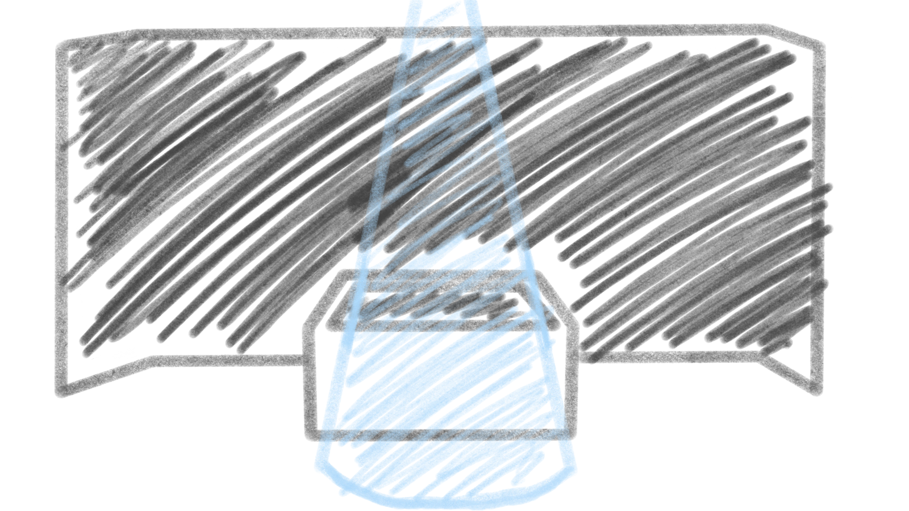
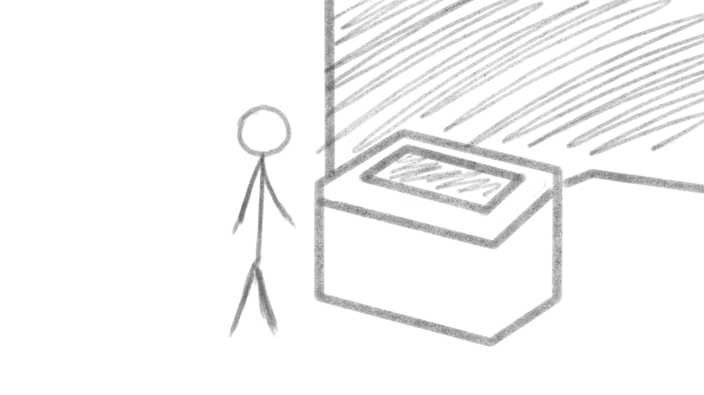
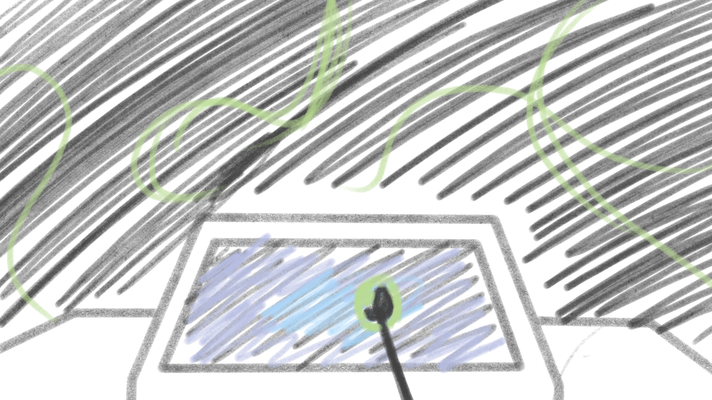
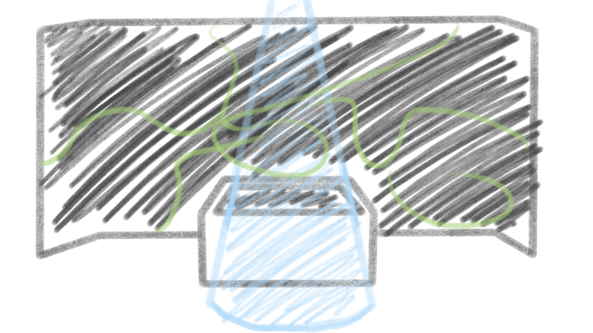

+# Préproduction
> C'est ici qu'on dépose les éléments de la préproduction.

# Table des matières
1. [Intention ou concept](#Intention-ou-concept)
    - [Cartographie](#Cartographie)
    - [Intention de départ](#Intention-de-départ)
    - [Synopsis](#Synopsis)
    - [Tableau d'ambiance (*moodboard*)](#Tableau-d'ambiance-(*moodboard*))
    - [Scénario, scénarimage ou document audio/visuel](#Scénario,-scénarimage-ou-document-audio/visuel)
2. [Contenu multimédia à intégrer](#Contenu-multimédia-à-intégrer)
    - [Inventaire du contenu multimédia](#Inventaire-du-contenu-multimédia)
    - [Univers artistique des éléments](#Univers-artistique-des-éléments-centraux)
3. [Planification technique d'un prototype (devis technique)](#Planification-technique-(devis-technique))
    - [Schémas ou plans techniques](#Schémas-ou-plans-techniques)
    - [Matériaux requis](#Matériaux-de-scénographie-requis)
    - [Équipements requis](#Équipements-requis)
    - [Logiciels requis](#Logiciels-requis)
    - [Ressources humaines requises](#Ressources-humaines-requises)
    - [Ressources spatiales requises (rangement et locaux)](#Ressources-spatiales-requises-(rangement-et-locaux))
    - [Contraintes techniques et potentiels problèmes de production](#Contraintes-techniques-et-potentiels-problèmes-de-production)
4. [Planification de la production d'un prototype (budget et étapes de réalisation)](#Planification-de-la-production-(budget-et-étapes-de-réalisation))
    - [Budget prévisionnel](#Budget-prévisionnel)
    - [Échéancier global](#Échéancier-global)
    - [Liste des tâches à réaliser](#Liste-des-tâches-à-réaliser)
    - [Rôles et responsabilités des membres de l'équipe](#Rôles-et-responsabilités-des-membres-de-l'équipe))
    - [Moments des rencontres d'équipe](#Moments-des-rencontres-d'équipe)

# Intention ou concept
<!---[comment]: <> (## Cartographie)

[comment]: <> (> Exemples:)

[comment]: <> ()

[comment]: <> ()

[comment]: <> ()--->

## Intention de départ
Celestial est une œuvre multimédia immersive qui relie l'humain et le temps. De nos jours , le temps controle notre vie, on est toujours occupé et on a moins le temps de rien faire car la vie va trop vite. L’œuvre consiste à insité l'intéracteur à vouloir oublier le temps qui passe et d'apprésier le temps présent.

Celestial est une ouvre concentrer sur le thème du temps et la mémoire humaine. Dans notre oeuvre on représente ça par une toile et de la projection. La toile est le support qui va comme représenter le cerveau, les neurones et les projections sur les murs vont représenter nos souvenirs.

Lorsque nous allons appuyer sur la toile , selon la force exercer sur celle-ci une fois appuyer une nouvelle "ligne/forme" va apparaitre. a chaque fois que l'intéracteur appuie il va y avoir une forme/ligne abtraite qui va s'ajouté. et après par exemple 5 minutes certaines lignes vont commencer à disparitre tranquillent un peu pour symboliser les souvenirs qu'on fait , ces ligne vont donner l'impression d'explorer les neurones des êtres humains.

## Quatre éléments spécifiques au médium de l’interactivité

Nom d'équipe : Célestia

Le public cible est le public explorateur. En effet, le public que notre oeuvre attire c'est des gens curieux qui souhaitent voyager à travers notre oeuvre. De plus, se sont des personnes aventureux qui désirent se déplacer dans l'espace et découvrir de nouvelles choses.

Écrire deux phrases sur chaque les quatre éléments spécifiques au médium de l’interactivité (8 phrases au total).Voir document.

Comportement de l'intéracteur:

Esthétique: L'esthétisme d'un projet intéractif c'est le visuel physique de l'oeuvre ainsi que la cohérence entre les différent choix arstique comme le son, les images et les structures. De plus, c'est aussi la beauté du code par exemple son aligment et les commentaire. La propreté dans la programmation fait aussi partie de l'esthétisme. Pour ce qui est de notre projet nos choix artistiques sont très cohérent, ils ont tous été réflechi en conséquence. Par exemple tout ce qui est physique de l'oeuvre comme la toile et sa struture c'est très sobre. Pour ce qui est du code dans notre projet, il est bien exécuté et très clair. Notre programmation se fait dans Touchdesigner. Pour finir, la bande sonore et le visuel se complète très bien dans leur côté mystérieux.

Espace:

Temps:

Répondre à ces deux questions sur les émotions :

· Quelles émotions voulez-vous faire vivre à l’interacteur?
L'émotion
· Pourquoi?

Répondre à ces questions sur comment attiser la curiosité des interacteurs :

· Quelles questions votre projet met-il dans l’esprit de l’interacteur?

Qu'est ce que c'est ?

À quoi sert la toile?

À quoi toutes ces lignes projeter?

· Que devrez-vous faire pour qu’il ait envie de réponde à ces questions?

Pour attirer l'intérateur à s'intéresser à notre oeuvre nous avons fait en sorte de placer un spotlight au dessu de la toile. De plus, nous allons faire en sorte que lorsqu'il y a personne près de notre projet la projection qui est sur les trois murs va défiler très vite et une fois qu'il va y avoir quelqu'un de près elle va commencer à ralentir. Tout ces éléments ensemble vont attirer l'intérateur vers notre toile. Quand il va être devant la toile le spotlight va s'éteindre pour que l'utilisateur comprenne qu'il a un contrôle sur l'oeuvre et qu'il soit attirer vers la toile pour la toucher.

## Tableau d'ambiance (*moodboard*)

### Moodboard de l'idée de projet 

### Moodboard Visuel

 
 > title="Physarum with Touchdesigner"
https://www.youtube.com/watch?v=2k6H5Qa_fCE&t=123s

### Moodboard Sonore

ambiance générale style white noise: https://www.youtube.com/watch?v=ArwcHjmsw3A 

ambiance générale plus dynamique :https://www.youtube.com/watch?v=7jOySuVa3RM

ambiance générale: https://www.youtube.com/watch?si=RrL2yh7cbbV1RWA0&v=1Mbn5GRYoRw&feature=youtu.be

effet sonore impact :https://www.youtube.com/watch?v=LzDUGEwA5p8

effet sonore souvenir :https://www.youtube.com/watch?v=Am4wYTiHHx8

ambiance : https://www.youtube.com/watch?v=f7rspgCiYqk (0à 7 seconde)

## Scénario, scénarimage ou document audio/visuel

Ce que l'interacteur voit quand il arrive à l'installation

Lorsque l'interacteur arrive devant l'installation, le spotlight au-dessus s'éteint et la projection sur le cyclo ralentira.

Lorsque l'interactuer appuie sur la toile, la projection sur celle-ci changera où il appuie. De plus, la projection sur le cyclo aura un effet qui apparaitera après un certain delai. 

Enfin, une fois que l'interacteur quitte l'installation, l'effet qu'il a crée sur la projection au cyclo demeura pendant un certain nombre de minutes, afin qu'il puisse voir l'impact qu'il a eu sur l'oeuvre.

# Contenu multimédia à intégrer
## Inventaire du contenu multimédia

- 1 animation générative pour la toile 
- 1 animation pour le mur
- 2 ambiances sonores
- 7 modules multimédias (ex. captation des données, interprétation des données, contrôle d'éclairage, effets audiovisuels, contrôle vidéo, contrôle de la navigation utilisateur & des différents sous-modules, diffusion et interaction en ligne...).
- ...

Pour plus de détails: [Inventaire du contenu à intégrer](https://cmontmorency365.sharepoint.com/sites/TIM-58266B-Expriencemultimdiainteractive-Enseignants/_layouts/15/Doc.aspx?OR=teams&action=edit&sourcedoc={8D242B82-E599-49CF-BE4C-EA9539D2D1C3})

## Univers artistique des éléments
Voir colonne *Exemples de réalisation* dans l'[Inventaire du contenu à intégrer](https://cmontmorency365.sharepoint.com/sites/TIM-58266B-Expriencemultimdiainteractive-Enseignants/_layouts/15/Doc.aspx?OR=teams&action=edit&sourcedoc={8D242B82-E599-49CF-BE4C-EA9539D2D1C3}).

# Planification technique d'un prototype (devis technique)
## Schémas ou plans techniques
> Insérer plans, documents et schémas pertinents dans cette sectio.  

### Plantation 

> Plantation vu de haut

> Plantation vu de face

 
### Schéma de branchement 

## Matériel de scénographie requis

> Liste des matériaux de scénographie (matériaux de décor) requis ou lien vers un tableur Excel ou document Markdown à part si nécessaire (quantité, spécifications techniques, lien vers fiche technique si applicable, commentaires...)

* Toile de spandex
    * 30" x 40"

* Cyclorama
* Construction en bois pour tenir la toile

## Équipements requis
> Liste des équipements requis par département ou lien vers un tableur Excel ou document Markdown à part si nécessaire (quantité, spécifications techniques, lien vers fiche technique si applicable, commentaires...)

* Audio
    * 4 haut-parleurs actifs de 4"
    * 5 fils XLR 3 conducteurs de 15'
    * powercon 
 

* Vidéo
 
    * 4 systèmes d'acrochage
    * 2 kinects
    * 3 cables HTMI

* Lumière
    * 1 lumières LED RGBAW DMX
    * 2 fils XLR 3 conducteurs de 20'
    * powercon
  

* Électricité
    * 2 cordons IEC (pour l'alimentation des haut-parleurs)
    * 2 extention

* Réseau
  
    * 4 cables ethernet
    * 3 received et transmited

* Ordinateurs
    * 1 ordinateurs portables
    
* Autres
  

## Logiciels requis
> Liste des logiciels requis, version ainsi que leurs dépendences

* [TouchDesigner](https://derivative.ca/) 
    * [QlC+](https://www.qlcplus.org/)
* [MadMapper](https://madmapper.com/)
* [VCV Rack 2](https://vcvrack.com/Rack)

## Ressources humaines requises
> Formaté en liste ou en lien vers un tableur Excel.

* TTP, location de matériel
* Guillaume

## Ressources spatiales requises (rangement et locaux)
> Spécifications des espaces nécessaires formaté en liste ou lien vers un tableur Excel.

* Grand studio
    * Projection vidéo dans le cyclo
    * Capatation vidéo
    * Toile Spandex extensible

## Contraintes techniques et potentiels problèmes de production

[problèmes envisgés](https://cmontmorency365-my.sharepoint.com/:x:/r/personal/2052728_cmontmorency_qc_ca/Documents/Classeur1.xlsx?d=wedb6d769c88843739365054fcd1149ee&csf=1&web=1&e=hBobIN)

# Planification de la production d'un prototype (budget et étapes de réalisation)
## Budget prévisionnel

[Lien vers document](https://cmontmorency365.sharepoint.com/:x:/s/TIM-58266B-Expriencemultimdiainteractive-Enseignants/ERS3zx4iKAlLn03N_0h3cyQBOV_nxNuKvrKnqmrXGcgDYg?e=Rjq9Uc)
[Budget](https://cmontmorency365-my.sharepoint.com/:x:/g/personal/2052728_cmontmorency_qc_ca/EQuySqnt1V5Lp-1WpiS0FhwB0_P74i3e_VFehdjQoZS8JQ?e=9bTmcS)

## Échéancier global
Étapes importantes du projet visualisé dans GitHub (*milestones*):  
https://github.com/tim-montmorency/66B-modele_de_projet/milestones

*Dates importantes :*
- Première itération : 12 au 17 février 
- Prototype finale : 26 février au 1er mars
- Présentation des projets devant public : du 18 mars au 22 mars

## Liste des tâches à réaliser
Visualisation des tâches à réaliser dans GitHub selon la méthode Kanban:  
https://github.com/orgs/Houston-we-have-a-project/projects/1/views/1

Inventaire des tâches à réaliser dans GitHub selon le répertoire d'*issues*:  
https://github.com/Houston-we-have-a-project/Projet-final-2024-planification/issues?q=is%3Aopen+is%3Aissue

## Rôles et responsabilités des membres de l'équipe
> Il vous est proposé ici de nommer une personne à la coordination générale du projet, à la coordination technique et à la coordination artistique. Les grandes décisions sur les grandes orientations du projet devraient se prendre en groupe lors de rencontres d'équipe. Cependant, les décisions entre vos rencontres de groupe devraient appartenir à ces personnes.

**Laurie Houde**
- Coordination générale du projet (coordination de l'échéancier, du budget, suivi de la liste des tâches à réaliser, s'assurer de la répartition du rôle et des responsabilités des membres de l'équipe);
- Gestion du spotlight dirigé vers le tapis;

Liste des tâches dans Git Hub:  
https://github.com/Houston-we-have-a-project/Projet-final-2024-planification/issues/assigned/lauriehoude
https://github.com/orgs/Houston-we-have-a-project/projects/1/views/1?filterQuery=assignee%3Alauriehoude

**Felix Testa Radovanovic**
- Comité Technique et coordination technique (suivi du devis technique);
- Programmation dans TouchDesigner de la détection de distance avec Kinect;
- Programmation dans TouchDesigner de la modification visuelle et sonore;
- Installation de l'équipement dans l'espace physique.

Liste des tâches dans Git Hub:  
https://github.com/Houston-we-have-a-project/Projet-final-2024-planification/issues/assigned/im-boyo 
https://github.com/orgs/Houston-we-have-a-project/projects/1/views/1?filterQuery=assignee%3A%22im-boyo%22

**Jolyanne Desjardins**
-Coordination technique (Équipement et matériel)
- Coordination artistique (attention plus particulière pour s'assurer que l'intention/concept artistique du projet initial reste, sinon consulter les membres de l'équipe);
- Mapping vidéo;
- Communication entre les projecteurs avec TouchDesigner et MadMapper;

Liste des tâches dans Git Hub:  
https://github.com/Houston-we-have-a-project/Projet-final-2024-planification/issues/assigned/jolyanneDesgardins
https://github.com/orgs/Houston-we-have-a-project/projects/1/views/1?filterQuery=assignee%3AjolyanneDesgardins

**Maïka Désy**
- Coordination artistique (attention plus particulière pour s'assurer que l'intention/concept artistique du projet initial reste, sinon consulter les membres de l'équipe);
- Création des projections;
- Création des drones;

Liste des tâches dans Git Hub:  
https://github.com/Houston-we-have-a-project/Projet-final-2024-planification/issues/assigned/2142692
https://github.com/orgs/Houston-we-have-a-project/projects/1/views/1?filterQuery=assignee%3A2142692

**Tâches pas encore attribuées**  
https://github.com/Houston-we-have-a-project/Projet-final-2024-planification/issues?q=is%3Aopen+is%3Aissue+no%3Aassignee
https://github.com/orgs/Houston-we-have-a-project/projects/1/views/1?filterQuery=no%3Aassignee

## Moments des rencontres d'équipe
Hebdomadaire
- Mardi à 10h45: Rencontre de suivi de projet.

Autre: 
- à déterminer 
